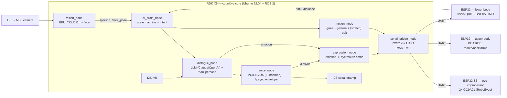
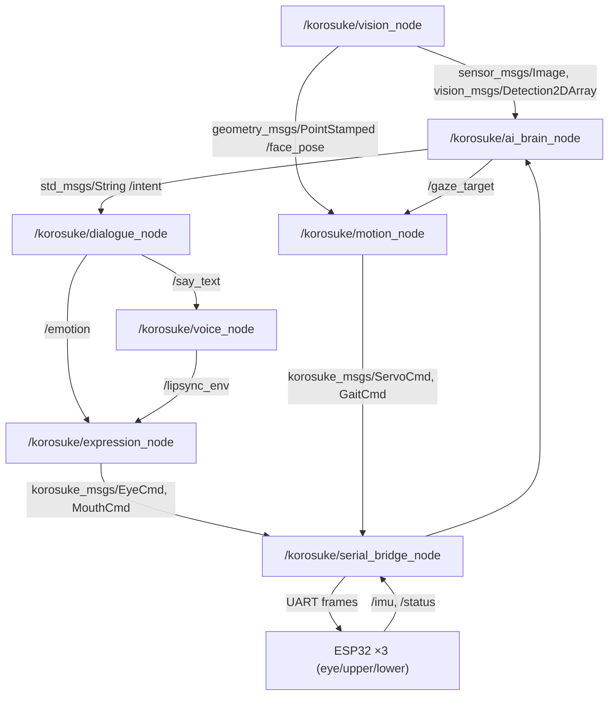

# Project Korosuke — Stage 2 (Build): System Design

D-Robotics **Robotics Dream Keeper Challenge** — Stage 2 design document.
Korosuke (コロ助) is the samurai-robot from *Kiteretsu Daihyakka*, rebuilt as a
50 cm desktop animatronic whose brain is an **RDK X5** (10 TOPS BPU, ROS 2).

> **Status:** v1.0 (2026-07-05, submitted). Builds directly on the Stage 1 result
> ([STAGE1.md](STAGE1.md)) — on-device YOLO11 vision is already proven.
> **Key pivot documented here:** the original design (3× ESP32 + a home server
> doing the AI) is **re-wired** so the RDK X5 is the cognitive core and the ESP32s
> become its servo/actuator sub-controllers, all under a ROS 2 graph.
>
> ⚠️ **This is the Stage-2 *plan*, not the shipped robot.** Some proposed subsystems
> were **deferred / not built** — notably the **2-axis mouth & lip-sync**, the **neck servo**
> (gaze is eyes-only), **bipedal QDD walking** (stretch), and VOICEVOX was replaced by
> on-device Open JTalk TTS. See **[STAGE3.md §8](STAGE3.md#8-known-issues-limitations--failure-recovery)**
> for exactly what shipped vs. what was deferred.

---

## 1. Concept

### 1.1 What Korosuke does
A child-minded samurai robot that **sees, talks, emotes, and gestures** — and, as a
stretch, **walks**. He recognizes a person, turns to look, greets them in his
trademark "…nari" speech, shows emotion through large animated eyes, and reacts
with head/arm gestures. All perception and dialogue run **on-device** on the RDK X5.

### 1.2 Why RDK X5 at the center (the Stage-1 pivot)
The pre-challenge design pushed AI to an external home server and used 3 ESP32s as
peers. Stage 1 proved the RDK X5 can run the perception **on the board** (YOLO11n on
the BPU). Stage 2 therefore promotes the RDK X5 to the **single cognitive core** and
demotes the ESP32s to **dumb, real-time actuator drivers** it commands. This removes
the network round-trip from the perception loop and gives a clean ROS 2 architecture.

### 1.3 Measurable goals (acceptance criteria)
Grounded in Stage 1 measurements (live USB-cam YOLO11n **8.3 FPS end-to-end**, BPU
alone **~67 inferences/s**, idle **66 °C → ~49 °C** with the fan lid):

| # | Capability | Target (measurable) | Stage-1 basis |
|---|-----------|---------------------|---------------|
| G1 | Vision (person/face) | ≥ 10 FPS sustained on BPU; detection→action latency < 150 ms | 8.3 FPS live, 67 FPS BPU headroom |
| G2 | Gaze / head tracking | Eyes + neck follow a face, error < 5° after 300 ms | new |
| G3 | Voice dialogue | wake → LLM → speech start < 3.0 s; "…nari" style 100% | server already implemented |
| G4 | Lip-sync | mouth follows audio envelope within 100 ms | protocol has LIPSYNC_DATA |
| G5 | Eye emotion | ≥ 30 FPS render on 2× GC9A01, 7 emotions | RoboEyes-class |
| G6 | Thermal under load | BPU+CPU+vision sustained < 60 °C | 50 °C @ 20 s BPU load (fan) |
| G7 | *(stretch)* Bipedal | quasi-static "penguin" gait, 3+ steps, no fall | QDD revival gated |

---

## 2. AI System Architecture

### 2.1 End-to-end data flow



### 2.2 ROS 2 node / topic graph



**Custom messages** (`korosuke_msgs`): `EyeCmd` (gazeX, gazeY, emotion, blink),
`MouthCmd` (open 0-1), `ServoCmd` (joint id, angle), `GaitCmd` (step, dir),
`Detection` (label, score, bbox). The existing **`protocol.h` (0xAA…0x55)** frame
is kept as the wire format; `serial_bridge_node` serializes ROS 2 msgs to it, so
the ESP32 firmware barely changes.

### 2.3 Compute & resource allocation

RDK X5 = 8× Cortex-A55 (CPU), 10 TOPS BPU, 8 GB LPDDR4, Mali GPU.

| Engine | Workload | Budget | Notes |
|--------|----------|--------|-------|
| **BPU** | YOLO11n detection (+ face crop/landmarks) | ~15 % of 67 FPS headroom at 10 FPS | model already converted (Bayes-e .bin) |
| **CPU core 0-1** | ROS 2 DDS + node executors | moderate | Cyclone DDS |
| **CPU core 2-3** | dialogue_node (async LLM HTTP) + persona | I/O-bound | reuse `server/` code |
| **CPU core 4** | voice_node: VOICEVOX client + audio I2S + lipsync envelope | real-time audio | MAX98357A out, INMP441 in |
| **CPU core 5** | motion_node: gaze/gesture planning, (stretch) gait | light | |
| **CPU core 6-7** | serial_bridge + headroom | low | 3× UART @ 115200 |
| **ESP32-S3 (eyes)** | 2× GC9A01 @ ≥30 FPS, RoboEyes | dedicated MCU | off-loads display from RDK |
| **ESP32 (upper)** | PCA9685 #1: mouth/neck/arms, 50 Hz | dedicated MCU | existing firmware |
| **ESP32 (lower)** | servo/QDD + BNO055 100 Hz balance | dedicated MCU | existing skeleton |

**Thermal:** sustained BPU+CPU stays < 60 °C with the open-source **fan lid**
(5 V 40 mm fan off the 40-pin header) — validated in Stage 1.

---

## 3. Engineering Plan

### 3.1 Bill of Materials (summary)
This table is the canonical BOM. As-built hardware deltas for the shipped robot (φ50 speaker on a MAX98357A I2S amp, Logitech C270 camera, safe-power button, mic taken from the C270) are in [STAGE3.md](STAGE3.md).

| Subsystem | Part | Qty | Status |
|-----------|------|-----|--------|
| Brain | RDK X5 8GB + open-source fan case | 1 | ✅ owned / case done |
| Eyes | GC9A01 1.28" 240×240 SPI | 2 | to buy (~¥2.4k) |
| Eye coproc | ESP32-S3 N16R8 | 1 | to buy (~¥2.5k) |
| Camera | UVC USB (Stage 1) → MIPI CSI (planned) | 1 | ✅ working |
| Face/neck/arms | PWM servos (SG90/MG996R) + PCA9685 ×2 | ~12 + 2 | ✅ in stock |
| Audio | INMP441 mic, MAX98357A amp + speaker | 1 set | ✅ in stock |
| IMU | BNO055 | 1 | ✅ in stock |
| Touch (head-pat) | TTP223 capacitive touch sensor | 1 | 🔜 planned — not yet installed |
| Legs *(stretch)* | SteadyWin GIM8108-36 QDD (CAN) | ≤8 | ⚠️ junk, unverified |
| Power | LiPo 3S/4S + DC-DC + AC adapter | — | ✅ in stock |

### 3.2 Proposed repository layout
```
corosuke/
  ros2_ws/src/                # NEW — the cognitive core
    korosuke_msgs/            # EyeCmd, MouthCmd, ServoCmd, GaitCmd, Detection
    korosuke_vision/          # BPU YOLO11 + face -> /person, /face_pose
    korosuke_brain/           # state machine + intent
    korosuke_dialogue/        # LLM + persona (port of server/corosuke_personality.py)
    korosuke_voice/           # VOICEVOX client + audio I/O + lipsync
    korosuke_expression/      # emotion -> eye/mouth
    korosuke_motion/          # gaze/gesture/(gait)
    korosuke_bridge/          # ROS2 <-> protocol.h UART
  firmware/                   # EXISTING — minor refactor (eye/upper/lower)
  server/                     # EXISTING — folded into korosuke_dialogue/voice
  hardware/3d_models/         # EXISTING — body + RDK X5 case
  docs/                       # this design, BOM, inventory, research
```

### 3.3 Roadmap (as of 2026-07-05 → hard deadline 2026-07-15)

**Done so far:** Stage 1 (BPU YOLO11 vision, thermal fan-lid, open-source RDK X5
case) ✅; full 3D body redesigned for color-split printing ✅; eye coprocessor
firmware flashed (2× GC9A01 on ESP32-S3, LovyanGFX) ✅; chest stereo-camera mount
designed ✅. See the live plan in [ROADMAP.md](ROADMAP.md).

| Window | Milestone | Exit criterion |
|--------|-----------|----------------|
| **7/5–7/7** | ROS 2 Humble on RDK X5; `korosuke_msgs`; `serial_bridge` ↔ ESP32-S3 eyes | a ROS 2 topic makes the eyes blink / change emotion |
| **7/8–7/11** | `vision_node` (BPU) → `/face_pose`; gaze (eyes + neck) tracking; on-device dialogue loop (LLM + VOICEVOX) + lipsync; `expression_node` | Korosuke looks at a face and says a "…nari" line with lipsync |
| **7/12–7/13** | Integrated demo: see → turn → greet → emote → gesture, fully on-device; benchmark table (FPS / latency / thermal) | G1–G6 met; **competition-critical line complete** |
| **7/14–7/15** | 3–7 min demo video; Stage 3 showcase PR; bipedal stretch *iff* QDD revived | Stage 3 submission package |

### 3.4 Risk analysis

| # | Risk | Likelihood | Impact | Mitigation |
|---|------|-----------|--------|------------|
| R1 | **QDD GIM8108 are junk / dead** | high | high (no walking) | Bipedal is a **decoupled stretch**, never on the MVP critical path; MVP passes on a seated/standing torso |
| R2 | LLM/VOICEVOX latency or network drop | med | med | local response cache, canned "…nari" fallbacks, keep dialogue async off the perception loop |
| R3 | 2× GC9A01 @30 FPS too heavy for one MCU | med | med | dedicated **ESP32-S3 coprocessor** (not the RDK); RoboEyesTFT; drop to 240×240@30 per eye |
| R4 | Thermal throttling under multi-task | low | med | fan lid validated (−17 °C); monitor `hrut_somstatus` |
| R5 | Eye looks small (φ32 LCD in a 50 mm socket) | med | low | white diffuser ring + recessed mount in `corosuke_exterior.scad` |
| R6 | RoboEyes is **GPL-3.0** | low | med (licensing) | isolate eye firmware as a separate GPL component; keep core under its own license |
| R7 | Power budget if QDD added (high stall current) | med | med | separate LiPo rail + DC-DC (see BOM §3.1); current-limit; MVP runs on bench PSU |
| R8 | Timeline (7/8 is tight) | med | high | MVP-first decoupling; reuse existing firmware/server; this plan front-loads integration |

---

## 4. Reuse vs. new work

| Asset | Stage 1/pre status | Stage 2 action |
|-------|--------------------|----------------|
| `protocol.h` / `config.h` | complete | **reuse** as the RDK↔ESP32 wire format |
| `firmware/corosuke_main` | done (WiFi/cam/LLM) | **retire** — its brain role moves to RDK X5 |
| `firmware/corosuke_upper/lower` | skeletons | **refactor** into pure ROS2-driven servo nodes |
| `server/` (FastAPI+LLM+VOICEVOX) | done | **port** into `korosuke_dialogue`/`korosuke_voice` on-device |
| `corosuke_personality.py` ("…nari") | done | **reuse** verbatim |
| 3D body + RDK X5 case | done | **reuse**; only the eye socket needs tuning |
| BPU YOLO11n pipeline | proven (Stage 1) | **promote** into `vision_node` |

The heavy lifting is **re-wiring, not re-inventing** — most subsystems already exist;
Stage 2 puts the RDK X5 in charge and expresses the whole system as a ROS 2 graph.

---

*Assumptions to confirm with the team:* exact servo counts per joint (pending the
actuator-assignment table), whether the home server stays as a fallback or is fully
folded on-device, and the bipedal go/no-go once the QDD motors are bench-tested.
