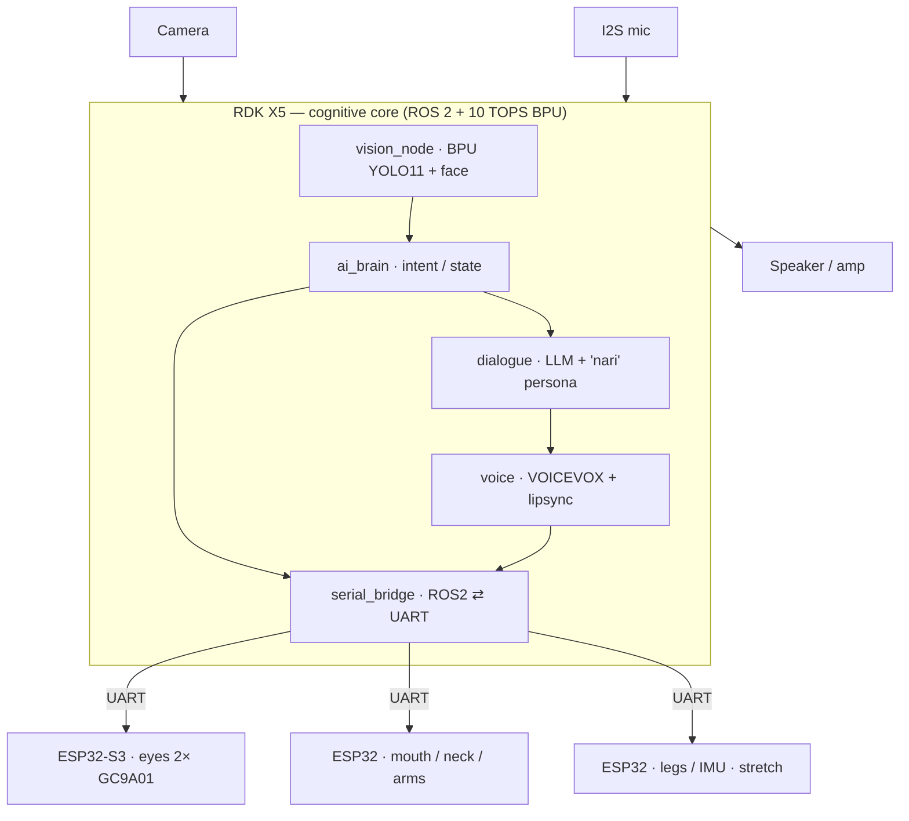

# 🤖 Corosuke Robot / コロ助ロボット

[](https://opensource.org/licenses/MIT)
[](https://developer.d-robotics.cc/)
[](https://docs.ros.org/)
[](https://www.espressif.com/)
[](https://openscad.org/)

An open-source animatronic robot inspired by Korosuke from "Kiteretsu Daihyakka" (キテレツ大百科), featuring expressive eyes, lip-sync speech, on-device AI vision, and bipedal walking.

> 🏆 **D-Robotics Robotics Dream Keeper Challenge** entry. **Stage 1 (Ignite) cleared — "RDK Explorer".** Now in **Stage 2 (Build)** — see the [system design doc](docs/stage2_design.md). On-device YOLO11 vision is live (8.3 FPS, [STAGE1.md](STAGE1.md)). A by-product is the first open-source [RDK X5 case](https://github.com/gurimaruking/rdk-x5-modular-case).

[English](#english) | [日本語](#japanese)

---

<a name="english"></a>
## 🇬🇧 English

### Overview

This project creates a full-size (50cm) Korosuke robot inspired by:
- **Disney's Olaf Robot** - Expressive animatronic eyes and face
- **BDX Droid** - Bipedal walking mechanism

### Features

| Feature | Description |
|---------|-------------|
| **Brain** | RDK X5 (10 TOPS BPU, ROS 2) — on-device perception + dialogue |
| **Vision** | BPU-accelerated YOLO11 person/face detection (live, on-board) |
| **Eyes** | 2× GC9A01 round displays driven by an ESP32-S3 eye coprocessor |
| **Expressions** | Animated eyes + 2-axis mouth (lip-sync) |
| **AI Chat** | On-device LLM + VOICEVOX TTS (speaks with "~nari" suffix) |
| **Walking** | *(stretch)* quasi-static bipedal "penguin" gait (QDD motors) |
| **Accessory** | 3D-printed sword on back |

### System Architecture

Korosuke's brain is a **D-Robotics RDK X5** (10 TOPS BPU, ROS 2). Perception and
dialogue run **on-device**; the ESP32s are real-time servo/actuator sub-controllers
it commands. Full design: **[docs/stage2_design.md](docs/stage2_design.md)**.



> **Architecture pivot (Stage 2):** the original design (3× ESP32 + an external
> home server running the AI) was re-wired so the RDK X5 is the single cognitive
> core. Stage 1 proved on-device YOLO11 vision (see [STAGE1.md](STAGE1.md)); Stage 2
> expresses the whole robot as a ROS 2 graph.

### Bill of Materials (BOM)

| Category | Items | Est. Cost |
|----------|-------|-----------|
| Brain | RDK X5 8GB + open-source fan case | ~$140 |
| Eyes | 2× GC9A01 + ESP32-S3 coprocessor | ~$40 |
| Electronics | ESP32 x2 (sub), servos, IMU, mic/amp | ~$120 |
| 3D Printing | PLA, TPU filaments | ~$50 |
| Mechanical | Bearings, screws, rods | ~$30 |
| **Total** | | **~$380** |

> Full, itemized BOM with selection rationale: [docs/bom.md](docs/bom.md) · [docs/inventory.md](docs/inventory.md).

### Quick Start

1. **Clone the repository**
   ```bash
   git clone https://github.com/YOUR_USERNAME/corosuke-robot.git
   cd corosuke-robot
   ```

2. **Set up the home server**
   ```bash
   cd server
   pip install -r requirements.txt
   cp .env.example .env
   # Edit .env with your API keys
   python main.py
   ```

3. **Flash firmware** (using PlatformIO)
   ```bash
   cd firmware/corosuke_upper
   pio run --target upload
   ```

4. **3D print parts** (using OpenSCAD)
   ```bash
   openscad hardware/3d_models/head/eye_mechanism.scad -o eye_mechanism.stl
   ```

### Directory Structure

```
corosuke/
├── ros2_ws/            # RDK X5 cognitive core (ROS 2) — Stage 2 (in progress)
│   └── src/            # korosuke_{msgs,vision,brain,dialogue,voice,
│                       #          expression,motion,bridge}
├── firmware/           # ESP32 sub-controller firmware (PlatformIO)
│   ├── corosuke_upper/ # Mouth / neck / arms (PCA9685)
│   ├── corosuke_lower/ # Legs / IMU (servo / QDD)
│   └── common/         # protocol.h (UART 0xAA..0x55), config.h
├── server/             # LLM + VOICEVOX (being folded on-device into ros2_ws)
├── hardware/3d_models/ # OpenSCAD: body + RDK X5 modular case
└── docs/               # stage2_design.md, bom.md, inventory.md, research
```

---

<a name="japanese"></a>
## 🇯🇵 日本語

### 概要

ディズニーのオラフロボットとBDXドロイドを参考に、フルサイズ（約50cm）のコロ助ロボットを製作するオープンソースプロジェクトです。

### 主な機能

| 機能 | 詳細 |
|------|------|
| **頭脳** | RDK X5（10 TOPS BPU・ROS 2）— オンデバイスで認識と対話 |
| **視覚** | BPUでYOLO11 人物/顔検出（実機ライブ動作済） |
| **目** | GC9A01丸型ディスプレイ×2（ESP32-S3 目コプロセッサ駆動） |
| **表情表現** | アニメ目 + 口2軸（リップシンク） |
| **AI会話** | オンデバイスLLM + VOICEVOX（「〜ナリ」語尾） |
| **二足歩行** | *(ストレッチ)* 準静的ペンギン歩き（QDDモーター） |
| **装備** | 背中に刀（3Dプリント製） |

### 部品表（BOM）

| カテゴリ | 内容 | 概算価格 |
|----------|------|----------|
| 頭脳 | RDK X5 8GB + 自作ファンケース | 約¥21,000 |
| 目 | GC9A01×2 + ESP32-S3コプロセッサ | 約¥5,700 |
| 電子部品 | ESP32×2(サブ), サーボ, IMU, マイク/アンプ | 約¥18,000 |
| 3Dプリント材料 | PLA, TPU フィラメント | 約¥7,500 |
| 機構部品 | ベアリング、ネジ、ロッド | 約¥4,500 |
| **合計** | | **約¥56,700** |

> 詳細BOM(選定理由つき): [docs/bom.md](docs/bom.md) ・ [docs/inventory.md](docs/inventory.md)

### クイックスタート

1. **リポジトリをクローン**
   ```bash
   git clone https://github.com/YOUR_USERNAME/corosuke-robot.git
   cd corosuke-robot
   ```

2. **ホームサーバーをセットアップ**
   ```bash
   cd server
   pip install -r requirements.txt
   cp .env.example .env
   # .envにAPIキーを設定
   python main.py
   ```

3. **ファームウェアを書き込み**（PlatformIO使用）
   ```bash
   cd firmware/corosuke_upper
   pio run --target upload
   ```

4. **3Dパーツを印刷**（OpenSCAD使用）
   ```bash
   openscad hardware/3d_models/head/eye_mechanism.scad -o eye_mechanism.stl
   ```

---

## Development Phases / 開発フェーズ

1. **Phase 1**: Head & Expression System / 頭部・表情システム
2. **Phase 2**: AI & Voice System / AI・音声システム
3. **Phase 3**: Body & Arms / 胴体・腕
4. **Phase 4**: Bipedal Walking / 二足歩行
5. **Phase 5**: Integration & Mobile App / 統合・スマホアプリ

## References / 参考資料

- [Disney Olaf Robot](https://thewaltdisneycompany.com/olaf-robotic-character/)
- [Open Duck Mini (BDX)](https://github.com/apirrone/Open_Duck_Mini)
- [Animatronic Eye Tutorial](https://www.instructables.com/Simplified-3D-Printed-Animatronic-Dual-Eye-Mechani/)

## Contributing / 貢献

See [CONTRIBUTING.md](CONTRIBUTING.md) for guidelines.

## License / ライセンス

MIT License - See [LICENSE](LICENSE) for details.

---

## Disclaimer / 免責事項

This is a fan-made project for educational and personal use. "Korosuke" (コロ助) is a character from "Kiteretsu Daihyakka" created by Fujiko F. Fujio. All character rights belong to their respective owners.

---

**「ワガハイはコロ助ナリ！」** 🤖
