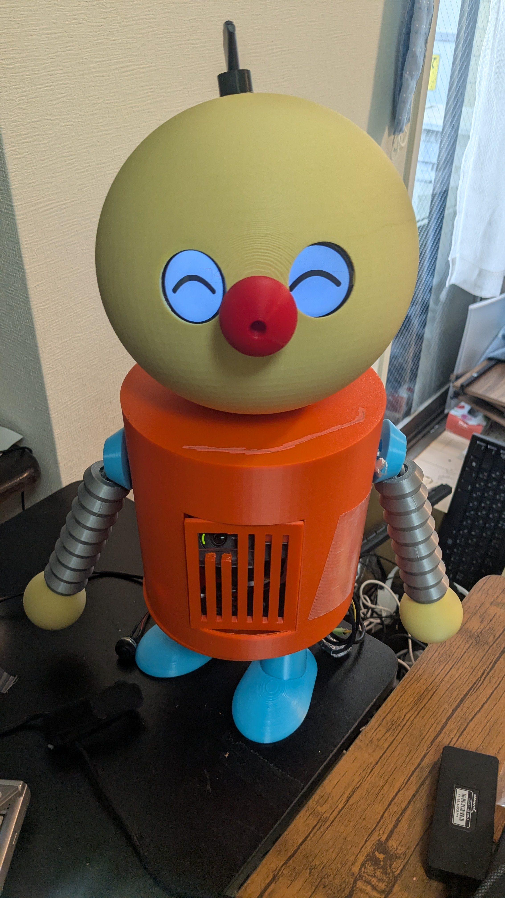
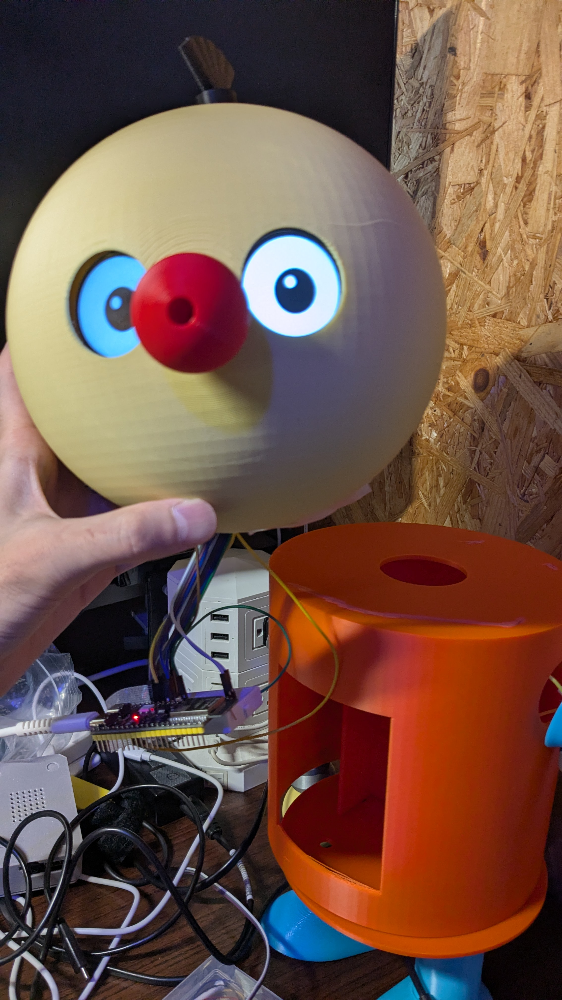
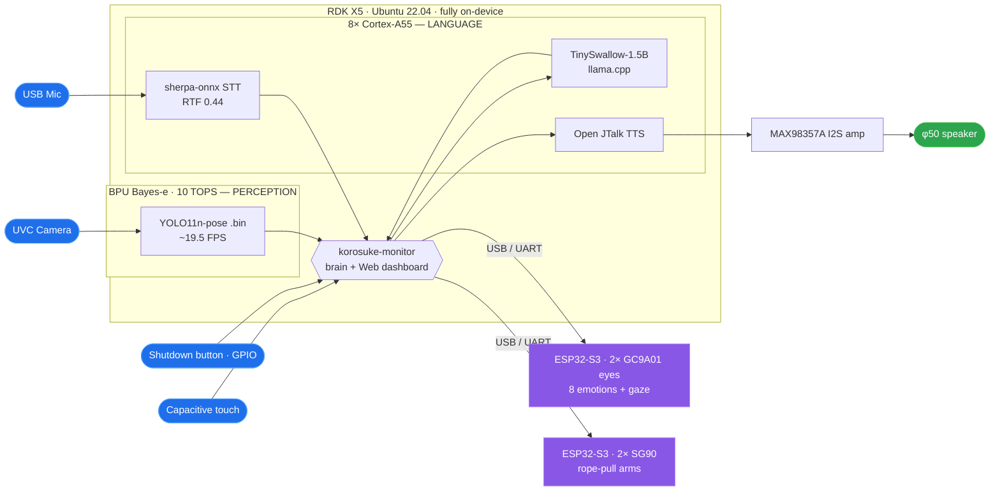
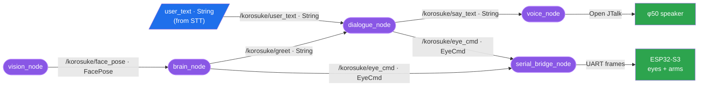

# Project Korosuke — Stage 3 (Launch): Fully On-Device Interactive Robot

D-Robotics **Robotics Dream Keeper Challenge** — Stage 3 showcase.
Korosuke (コロ助), the karakuri-robot from *Kiteretsu Daihyakka*, rebuilt as a ~46 cm
desktop animatronic whose brain is an **RDK X5** (10 TOPS BPU "Bayes-e", 8× Cortex-A55,
Ubuntu 22.04). A fan-made, non-commercial tribute.



> **Headline:** Korosuke **wakes up and greets you, sees you and follows you with its eyes, listens,
> thinks, talks back, smiles, ponders, reacts to gestures and to being petted, waves
> its arms, and shuts itself down safely — 100 % on-device. No cloud. No dev PC at
> runtime.** Vision, speech-to-text, LLM dialogue, text-to-speech, expression, gesture
> and actuation all run on a single RDK X5 + an ESP32-S3 eye/arm co-MCU.

🎥 **[▶ Watch the 10-second on-device conversation demo →](docs/photo/20260725_korosuke-robot-v0.1_movie.mp4)**

---

## 1. What Korosuke does (the integrated experience)

Power it on and, unattended:

0. **Wakes up** — on boot it auto-starts, self-checks its audio, blinks its eyes into a
   smile and says *"おはようナリ！コロ助、起きたナリ！"* while waving.
1. **Sees you** — BPU YOLO11-pose finds the largest person + 17-point skeleton.
2. **Looks at you** — the round eyes (2× GC9A01) track your position.
3. **Greets you** — a "…ナリ" greeting in a high childlike voice + waves both arms.
4. **Emotes** — smile / sad / angry / surprised / sleepy on the round displays.
5. **Reacts to gestures** — both hands up → *"バンザイ！"* + raises both arms; one hand
   up → *"はーい、ナリ！"*; one-hand wave → waves back with that arm.
6. **Talks with you** — your speech is transcribed on-device (sherpa-onnx JP); while the
   **on-device LLM** (TinySwallow-1.5B) thinks, the eyes show a **"考え中" pondering
   animation**; the reply is spoken via on-device TTS (Open JTalk) in Korosuke's
   "ワガハイ…ナリ" persona, and the eyes break into a smile.
7. **Likes being petted** — a capacitive touch sensor triggers "なでなで" reactions.
8. **Misses you** — when you leave frame it droops, says a farewell, then settles back
   to a calm awake face.
9. **Sleeps safely** — a physical button runs a graceful shutdown: sleepy eyes →
   *"おやすみナリ…また会おうナリ！"* → **✕✕ "power-off-OK" eyes** that stay lit after the
   OS halts, so you know when it's safe to cut power.

A **web dashboard** (`http://<board-ip>:8080`, tabbed **Monitor / Settings**) shows the
live camera + skeleton, mic level, recognition state and speech — and lets you tune every
parameter (volume, mic gain, voice pitch, thresholds, reaction toggles, eyes, arms, and a
**one-click audio self-test**) live from any PC on the LAN.

## 2. Stage-3 technical achievements (all measured on the real board)

| Capability | Implementation | On-device measurement |
|---|---|---|
| Vision (person + pose) | BPU YOLO11n-pose (Bayes-e `.bin`) | live camera ~**19.5 FPS** |
| Speech-to-text (JP) | **sherpa-onnx** ReazonSpeech Zipformer int8 + Silero VAD | **RTF 0.44** (real-time) |
| **On-device LLM dialogue** | **llama.cpp + TinySwallow-1.5B-Instruct Q5** (CPU) | load 24 s, **1.5–3.3 tok/s**, reply 5–10 s |
| Text-to-speech (JP) | **Open JTalk** pitched childlike voice (`-fm 9 -a 0.40`) | dynamic, any text, instant |
| **Audio out (miniaturized)** | **MAX98357A** I2S Class-D amp on 40-pin **i2s1** + φ50 8Ω speaker | custom-built card, DSP-tuned |
| Expression | 2× GC9A01 on ESP32-S3 (LovyanGFX): 8 states incl. smile / pondering / ✕✕ | ≥30 FPS render |
| Gesture recognition | skeleton (wrist-vs-shoulder): both/one raise + wave | in the pose loop, no extra model |
| Arm actuation | 2× SG90 rope-pull bellows arms on ESP32-S3 LEDC PWM | GPIO4/5, auto-detach to save current |
| Touch reaction | capacitive touch → "petting" responses | ESP32-S3 `EVENT touch` over serial |
| Safe power | GPIO shutdown button + boot auto-start (systemd) | goodnight voice + ✕✕-eyes signal |
| Maintenance net | eth0 **static 192.168.0.200** + usb0 gadget lifeline | auto-assigned on boot |

**Whole-stack thermal benchmark** (camera + pose + STT + LLM + TTS + eyes + arms all at
once, LLM pinning ~**600 % CPU**): CPU **≈50 °C** / BPU **≈50 °C** / DDR **≈51 °C**
(target < 60 °C ✅, no fan throttling), RAM ~2.2 GiB / 6.9 GiB used. The full experience
fits with headroom on one 8 GB board.

## 3. Hardware, miniaturized and packed into the body

The Stage-3 build moved the whole brain **inside the 3-D-printed body** (OpenSCAD,
color-split printing). Two size problems were solved this stage:

- **Speaker → MAX98357A.** The oversized 5 cm enclosed speakers were replaced by a small
  **φ50 mm 8 Ω driver** driven by a **MAX98357A I2S digital amp** off the RDK X5 40-pin
  I2S1. Because the RDK kernel ships **no** MAX98357A codec driver (and no in-tree dummy
  codec), we **built `snd-soc-max98357a` out-of-tree** against the on-board
  `hobot-kernel-headers`, authored a **device-tree overlay** (`simple-audio-card`,
  `dw_i2s1` ↔ `maxim,max98357a`), and made it auto-load. See
  [docs/rdk_x5_40pin_i2s_max98357a.md](docs/rdk_x5_40pin_i2s_max98357a.md).
- **Camera → bare UVC webcam** in the chest, behind the nose/chest port (see the lens in
  the chest cut-out of the hero photo). It is auto-detected (USB-preference, so RDK
  internal video nodes are never mistaken for the camera) and its built-in mic feeds STT.



*The head carries the two round GC9A01 eye displays (here in the wide "awake" look) and
the camera-in-nose port; the ESP32-S3 co-MCU on the bench drives the eyes and arms. The
orange body hides the RDK X5 + fan + MAX98357A amp + φ50 speaker.*

🎥 **Watch:** [**10-second on-device conversation demo**](docs/photo/20260725_korosuke-robot-v0.1_movie.mp4) ·
[rope-pull arm driven by the SG90 servo](docs/photo/Arm-pulling-by-surve-motor.mp4)

## 4. Engineering deep-dives (what made this hard, and how we proved it)

- **The BPU does vision; the CPU does language — and we proved the BPU *cannot* do the
  LLM on X5.** A multi-language, source-verified investigation
  ([docs/rdk_x5_bpu_llm.md](docs/rdk_x5_bpu_llm.md)) concludes: the RDK X5 Bayes-e BPU has
  **no official LLM toolchain** — the "large-model toolchain" is **RDK S100 (Nash)
  only**. Decisive evidence: D-Robotics' *own* X5 packages (`magicbox_qwen_llm`,
  `InternVL2_5-1B-GGUF-BPU`) run the language model on **llama.cpp/CPU**; the BPU only
  accelerates the vision (ViT) tower. So Korosuke's design — perception on the BPU,
  dialogue on the 8× A55 CPU — is the *correct* architecture for this board, not a
  limitation we failed to overcome.
- **"Loud but clean" on a tiny speaker.** We measured the small driver's clean ceiling at
  **≈ −6 dBFS** and built a playback DSP (high-pass to protect the cone + compressor +
  brick-wall limiter + peak-normalize to the ceiling) so the childlike voice is loud
  without the onset clipping we first heard. Output is a modest ~0.1–0.4 W — deliberately
  speaker-limited, not amp-limited.
- **Self-healing audio.** A cold-boot module load-order race can leave the I2S card in an
  un-openable state. A boot-time root service **and** a web **"🔈 audio self-test"**
  button verify the card and, if needed, re-bind it automatically.
- **Robust to hardware reality.** Debugged live: ESP32-S3 LEDC is **14-bit max** (16-bit
  silently emits no PWM); the eye's native-USB port resets on host open (use the CH343
  UART); servo release needs `ledcDetachPin`, not duty-0; a half-inserted USB power cable
  and a bad USB cable were diagnosed straight from `dmesg` (`Cannot enable. Maybe the USB
  cable is bad?`); camera/mic device names and indices are auto-detected so swapping the
  webcam "just works."

## 5. Architecture (no cloud)

**The BPU does perception; the CPU does language** — two parallel workloads, one board,
zero cloud. (GitHub renders the Mermaid diagram below.)



The board brings up its own network — reachable at **eth0 static `192.168.0.200`** on the LAN,
**or `192.168.128.10` over the Type-C (USB-C) gadget link** to a PC — and every component is a
**systemd** service that auto-starts on power-on. **No dev PC at runtime.**

### 5.1 ROS 2 node / topic graph (as-built)

The same pipeline is also implemented as a **ROS 2 graph** — 6 nodes + 2 custom messages,
started with `ros2 launch korosuke_nodes korosuke.launch.py` (code: [`ros2_ws/`](ros2_ws/);
Stage-2 design: [PROPOSAL.md §2.2](PROPOSAL.md)):



**Two integrations of one on-device pipeline.** The ROS 2 graph above (custom messages
`FacePose` / `EyeCmd`, topic-based nodes) satisfies the challenge's ROS 2 requirement; its
`dialogue_node` / `voice_node` run the **same fully on-device stack as the monolith —
TinySwallow-1.5B via llama.cpp and Open JTalk (no cloud, no API keys)**. For the interactive
showcase we also ship a **single low-latency `korosuke-monitor` service** that fuses the same
stages in one process (adding the Web dashboard, audio DSP and the 8-state eyes).

> **Verification status (honest).** All live testing and the demo video use the **monolith**.
> In the ROS 2 graph, the `vision_node → brain_node → serial_bridge → eyes` path is
> **verified on hardware**; the full graph including `dialogue_node` / `voice_node` is
> **code-complete and reuses the monolith's proven on-device modules, but has not yet been
> run end-to-end on the board.** Listening (STT) is **not yet a ROS node** — `dialogue_node`
> consumes `/korosuke/user_text`, which the monolith's sherpa-onnx STT (or manual input)
> publishes; a dedicated `stt_node` is future work.

## 6. Innovation highlights

- **A complete on-device conversational + expressive robot on a $140-class board** —
  JP-ASR, a real JP LLM, JP-TTS, 8-state emotion, gesture, touch and actuation, zero cloud.
- **Character-faithful & alive**: pitched "ワガハイ…ナリ" voice; hand-tuned **smile** and a
  **"thinking" eye animation** during the LLM's think time so the wait feels intentional;
  a rope-pulled bellows arm matching the 3-D-printed center-bore.
- **Custom kernel work**: an out-of-tree ALSA codec driver + device-tree overlay to add a
  digital I2S amp the vendor kernel didn't support — turning a $2 amp into a body-fit speaker.
- **Ships like a product**: power-on-to-greeting auto-start, a physical safe-shutdown with
  a clear "safe to unplug" signal, a static maintenance IP, and a web self-test.

## 7. Build / BOM

📋 **Full itemized BOM (with rationale) is in the Stage-2 design → [PROPOSAL.md §3.1](PROPOSAL.md).**
To avoid duplication, this section lists only the **Stage-3 as-built hardware changes** vs. that plan:

| Change in Stage 3 | Part | Why / ref |
|---|---|---|
| **Speaker miniaturized** | MAX98357A I2S amp + φ50 mm 8 Ω driver (WYGD50D-8-03) | fit the body; needed a **custom out-of-tree kernel driver + DT overlay** — [build](docs/rdk_x5_40pin_i2s_max98357a.md) · [firmware/max98357a/](firmware/max98357a/) · [g109012](https://akizukidenshi.com/catalog/g/g109012/) |
| **Camera** | UVC USB webcam (Logitech C270), mic built-in | on-device vision + STT; auto-detected on replug |
| **Safe power** | GPIO shutdown button | graceful halt (goodnight voice → ✕✕ eyes) — [deploy/](deploy/) |
| **Touch** | capacitive touch sensor | "petting" reactions |
| Mic | uses the C270's built-in mic (INMP441 in the plan not needed) | one fewer part |

> Louder-speaker upgrade path (optional): a φ40 mm **4 Ω / 3 W** full-range
> ([DXYD40-22P-4A](https://akizukidenshi.com/catalog/g/g116025/)) in a small sealed baffle
> roughly doubles clean output (mind the DSP ceiling, §8).

**Wiring & diagnostics:** [hardware block diagram](docs/hardware_block_diagram.md) ·
[40-pin I2S / MAX98357A](docs/rdk_x5_40pin_i2s_max98357a.md) ·
[network / maintenance](docs/network_setup.md) ·
[power/USB brown-out](docs/power_usb_troubleshooting.md).

## 8. Known issues, limitations & failure recovery

| Area | Known limitation | Recovery / mitigation |
|---|---|---|
| **LLM latency** | on-device 1.5B on CPU → 5–10 s to reply (the BPU *cannot* accelerate LLM on X5) | "考え中" eye animation covers the wait; canned "…ナリ" fallbacks — see [BPU-LLM analysis](docs/rdk_x5_bpu_llm.md) |
| **Power / USB brown-out** | an inadequate USB-C cable/adapter → no green LED, USB peripherals drop, flaky network | 5 V/3 A+ certified supply + short thick cable; diagnose from `dmesg`; full guide → [power_usb_troubleshooting.md](docs/power_usb_troubleshooting.md) |
| **Audio-card cold-boot race** | module load-order can leave the I2S card un-openable | boot-time root service **+** web **"🔈 audio self-test"** auto-rebind |
| **Peripheral swap** | camera index / mic-card name can change on replug | auto-detected (USB-preference + name lookup) |
| **No RTC** | battery-less clock resets offline | fake-hwclock; NTP when online |
| **Bipedal gait** ✴️ | stretch only — the salvaged QDD motors are unreliable | MVP is seated/standing; decoupled from the critical path |

**Not implemented in this build (deferred, not claimed as done):**
- **2-axis mouth / lip-sync** — no mouth mechanism is fitted; all expression is via the eyes and voice. Lip-sync (proposed as G4) is deferred.
- **Bipedal "penguin" walking (QDD legs)** — stretch only; the salvaged QDD motors are unreliable, so the MVP is a seated/standing torso.
- **Back-mounted sword prop** — not built.

**Safe shutdown / soft E-STOP:** a GPIO button runs a graceful halt (goodnight voice → ✕✕
"power-off-OK" eyes that persist after the OS halts); the arm servos **auto-detach** (zero
torque) between moves and on a web "🪫 relax" command — documented safety limit.

## 9. Stage-3 requirement coverage (for reviewers)

| Requirement | Where |
|---|---|
| System architecture | §5 Mermaid + ROS 2 graph ([PROPOSAL.md §2.2](PROPOSAL.md), code [`ros2_ws/`](ros2_ws/)) |
| **BPU-accelerated model** (name + runtime) | **YOLO11n-pose on Bayes-e BPU, ~19.5 FPS** (§2, table below) |
| Continuous real-time detection | pose loop runs live (not single-frame) |
| Multi-task (2+ parallel workloads) | BPU vision **+** CPU STT/LLM/TTS concurrently; CPU/BPU load & thermal in §2 |
| Motor/actuator control + safety limits | 2× SG90 rope-pull arms, auto-detach; 14-bit LEDC (§4, §8) |
| Safe shutdown / E-STOP | GPIO button + ✕✕-eyes signal (§8) |
| Interface spec / calibration | [docs/rdk_x5_40pin_i2s_max98357a.md](docs/rdk_x5_40pin_i2s_max98357a.md), [docs/TESTING.md](docs/TESTING.md) |
| Known issues / failure recovery | §8 + docs/ |
| Reproducible build / Quick Start | §10 + repo `README.md` |
| **Demo video 3–7 min (YouTube)** | ⚠️ **TODO** — currently a 10 s clip; a full 3–7 min take on YouTube is required |
| **LICENSE · community post · showcase PR** | ⚠️ **TODO** before final submission |

**Benchmark (measured on the board):**

| Task | Model / tool | Version | Result |
|---|---|---|---|
| Person + pose | YOLO11n-pose (Bayes-e `.bin`) | RDK OS 3.x / hbdk | ~**19.5 FPS** |
| STT (JP) | sherpa-onnx ReazonSpeech Zipformer int8 + Silero VAD | onnxruntime | **RTF 0.44** |
| LLM (JP) | TinySwallow-1.5B-Instruct Q5_K_M | llama.cpp | load 24 s, **1.5–3.3 tok/s** |
| TTS (JP) | Open JTalk (pitched) | apt | instant |
| Thermal — full stack, LLM at ~600 % CPU | — | `hrut_somstatus` | CPU/BPU/DDR **≈50–51 °C** (<60 °C ✅) |

> **BPU-acceleration proof:** YOLO11n-pose runs as a compiled Bayes-e `.bin` on the BPU
> (`hrut_somstatus` shows non-zero `bpu0` utilisation during inference); the LLM stays on
> the 8× A55 CPU **by design** (see [docs/rdk_x5_bpu_llm.md](docs/rdk_x5_bpu_llm.md)).

## 10. Reproduce

```bash
# On the RDK X5 — everything is one integrated service, auto-starting on boot:
sudo systemctl status korosuke-monitor   # camera+pose+STT+LLM+TTS+eyes+arms+touch
#   → open http://<board-ip>:8080  (Monitor / Settings tabs)
# Safe shutdown: hold the GPIO button ~1 s (goodnight voice → ✕✕ eyes → halt).
```
Component research + decisions:
[docs/dialogue_stack_research.md](docs/dialogue_stack_research.md) (LLM/TTS),
[docs/stt_research.md](docs/stt_research.md) (STT),
[docs/rdk_x5_bpu_llm.md](docs/rdk_x5_bpu_llm.md) (why BPU-LLM is S100-only),
[docs/mocap_capabilities.md](docs/mocap_capabilities.md) (gesture),
[docs/implementation_plan.md](docs/implementation_plan.md) (roadmap),
[docs/TESTING.md](docs/TESTING.md) (test commands),
[docs/diary/](docs/diary/) (build log).

---
*"ワガハイはコロ助ナリ！" — fully on-device, powered by RDK X5.*
Character © Fujiko F. Fujio — fan-made, non-commercial tribute.
