# I am Korosuke! — An era when anyone can build a robot

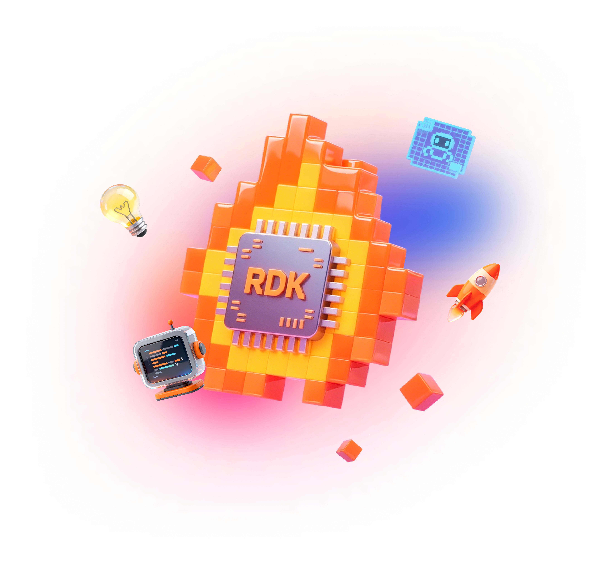

> D-Robotics **Robotics Dream Keeper Challenge** participation story (English version).
> 日本語版はこちら → [intro_ja.md](intro_ja.md) · Full technical details → [STAGE3.md](../../STAGE3.md)

## Table of contents

- [Introduction](#introduction)
- [Background](#background)
- [Architecture](#architecture)
  - [Hardware](#hardware)
  - [Software](#software)
- [Build process](#build-process)
  - [Mechanics (3D-printed body)](#mechanics-3d-printed-body)
  - [Wiring](#wiring)
  - [Software, built with AI](#software-built-with-ai)
  - [Operation (Korosuke Monitor)](#operation-korosuke-monitor)
  - [Tools & jigs](#tools--jigs)
- [Afterword](#afterword)
- [Troubleshooting (gotchas)](#troubleshooting-gotchas)

## Introduction

Korosuke is the partner **karakuri robot** built by Kiteretsu, the inventor-boy hero of
***Kiteretsu Daihyakka*** by the great manga artist **Fujiko F. Fujio**. Our Korosuke is a
**fan-made robot** built by members of **Robostadion**, a robot co-working space in Akihabara,
Tokyo — with a **D-Robotics RDK X5** as its brain. We designed the mechanics, electronics and
software **together with AI**, then 3D-printed, wired and programmed it. It **sees, listens,
thinks, talks and emotes — 100 % on the board, no cloud** — and was built for the
[Robotics Dream Keeper Challenge](https://github.com/D-Robotics/Robotics-Dream-Keeper-Challenge).
**An era when anyone can build their own robot is surely coming!**

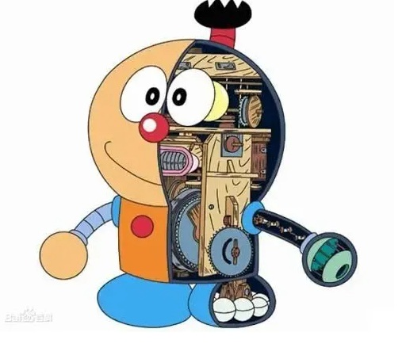

- Demo video: https://www.youtube.com/watch?v=NJwj6Iazd20

## Background

**Robostadion's owner (Kazuki Murata [@gurimaruking](https://github.com/gurimaruking) /
[@robostadion_sin](https://x.com/robostadion_sin)) once said to me: "Why not build Korosuke?"**

While Murata-san and the staff were busy preparing **REK** (*1 — a robot battle event held in
Akihabara), one day I looked at the Robostadion Discord, remembered that invitation —
went to Robostadion in Akihabara, received the Korosuke parts, and got to build it!

<table>
<tr>
<th align="center">Murata-san</th>
<th align="center">uecken</th>
</tr>
<tr>
<td>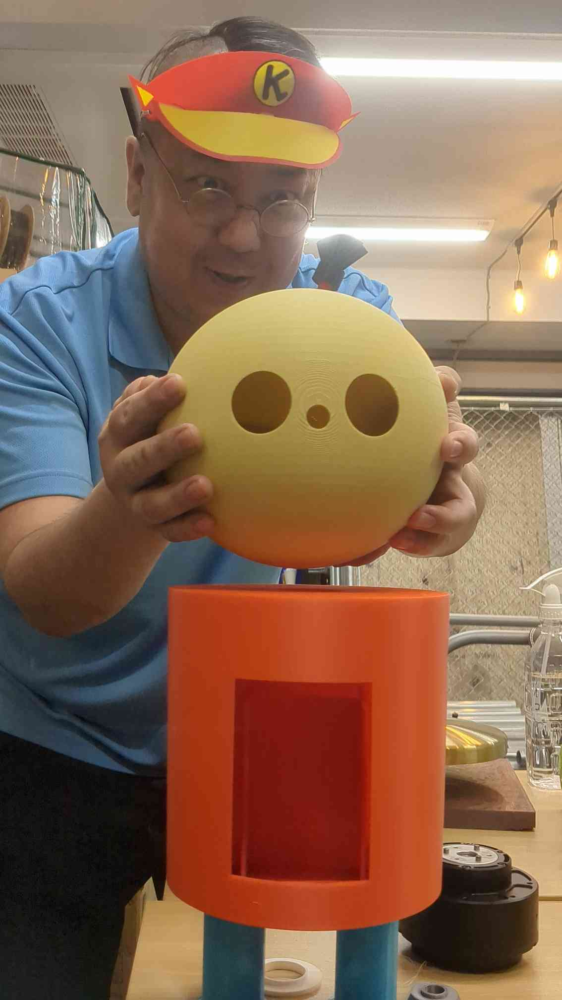</td>
<td>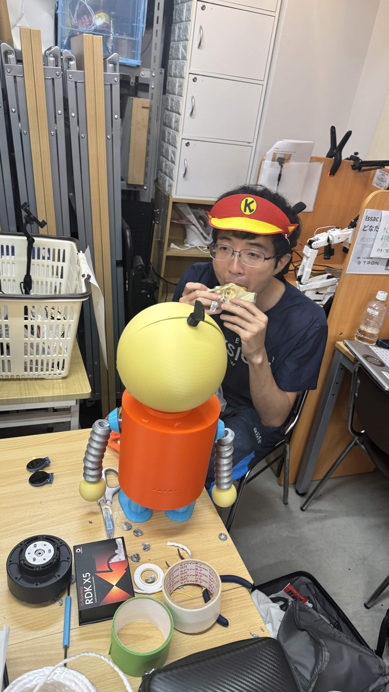</td>
</tr>
</table>

**Inspiration** —

- [Disney's Olaf robot](https://thewaltdisneycompany.com/olaf-robotic-character/) — expressive animatronic eyes & face
- [Open Duck Mini (BDX)](https://github.com/apirrone/Open_Duck_Mini) — compact bipedal droid

*1 REK — overview: https://robostadion.com/rek-tokyo/ , results: https://robostadion.com/rek-tokyo/report.html

## Architecture

### Hardware

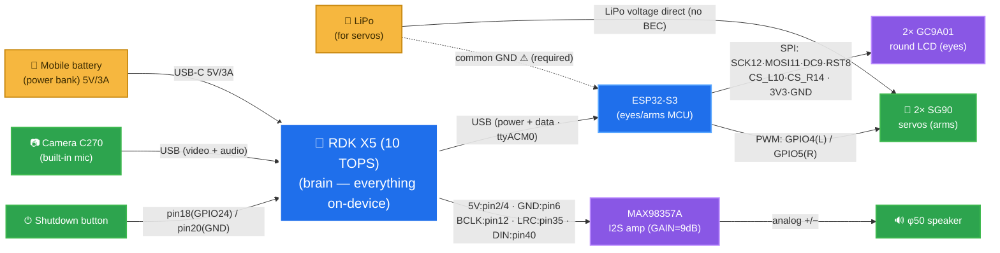

**Legend**: 🟡 Power · 🔵 Compute (board) · 🟣 Module · 🟢 Peripheral — pin numbers are on the wires.
**Two power rails** (power bank → RDK X5 · LiPo → servos) with a **shared common ground**.
Note: the **C270 is camera *and* microphone** (its built-in mic feeds speech recognition).
Full connection table: [docs/wiring.md](../wiring.md) · [docs/hardware_block_diagram.md](../hardware_block_diagram.md).

### Software

Everything runs **on the board only** (no internet). The **brain (korosuke-monitor)** at the
center of the diagram orchestrates ears, head, mouth, eyes and arms:

- 👂 **Listen** — the mic's voice is converted to text (speech recognition, STT) and sent to the brain
- 🧠 **Think** — the brain asks a small on-board AI (local LLM) to compose the reply
- 🗣 **Speak** — the reply is turned into Korosuke's voice (TTS) and played through the amp & speaker
- 👀 **See** — the **BPU (AI chip)** detects people in the camera image; the brain tells the eyes "look there"
- 💪 **Move** — the brain commands the ESP32-S3, which drives the eye expressions (8 kinds) and the arms
- ⏻ **Power button** — Korosuke says "good night", shows ✕✕ eyes, and shuts down safely

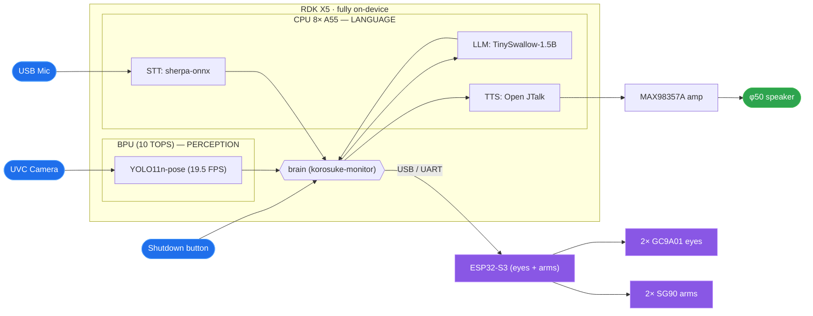

Composing a reply takes 5–10 seconds — the eyes show a "thinking" animation meanwhile.

## Build process

### Mechanics (3D-printed body)

The 3D parts were **co-created by Murata-san and AI**.
The part data lives in [hardware/3d_models/korosuke_print](../../hardware/3d_models/korosuke_print/)
(we used **v1** this time — v2+ folders exist but are untested!).

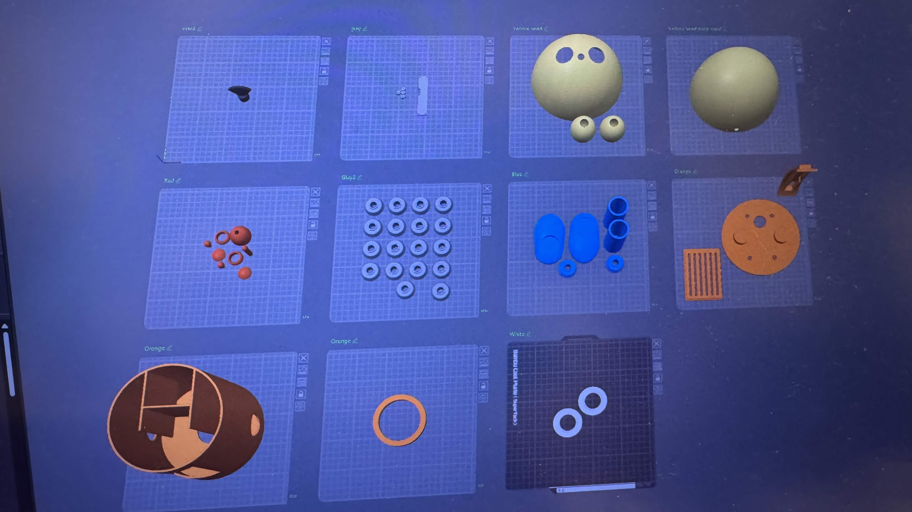
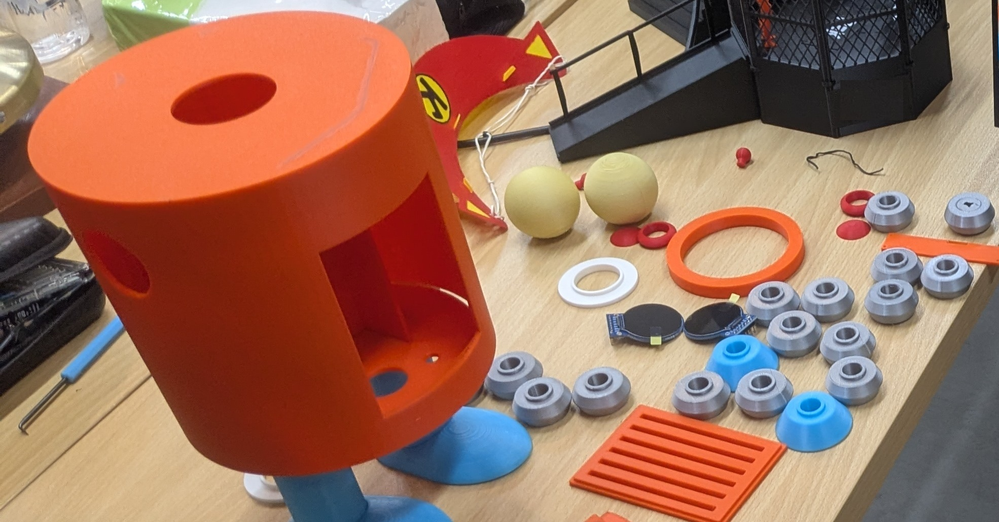

The enclosure parts:

- **Head**: two hemispheres; one gets **eye holes**, and the round-LCD eyes are inserted from the inside
- **Torso**: a cylinder that houses the RDK X5, camera, speaker and servos — **open at top & bottom**
  for installing parts, with **side holes for the rope-arms**
- **Arms & hands**: 8 linked rings threaded with a string; one end ties to the hand, the other to a
  servo (= the **rope-pull arm** — the servo pulls the string and the arm rises)
- **Torso base**: there was no cable exit at first, so we **cut the bottom open with an ultrasonic cutter**
- **Feet**: static this time — glued straight onto the base

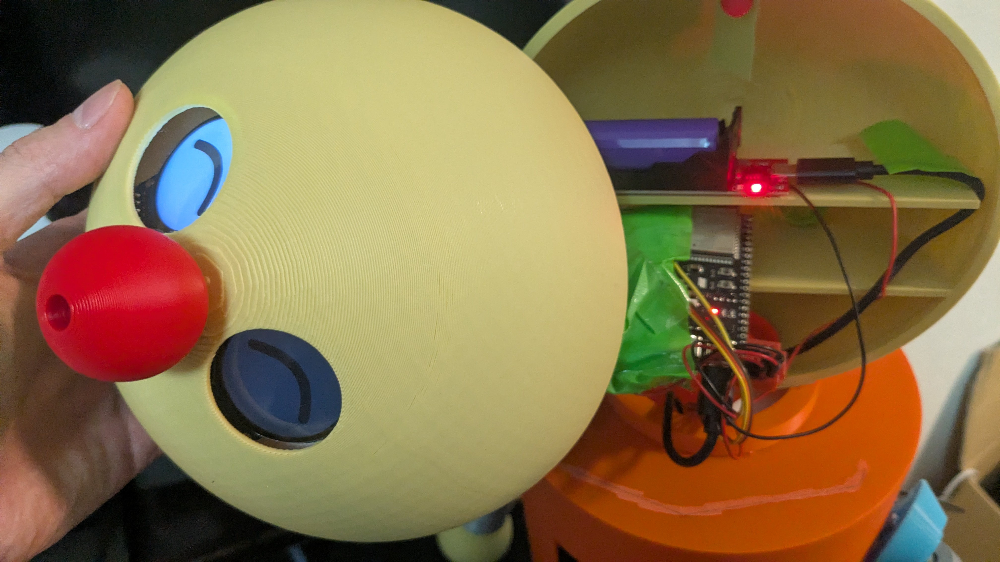
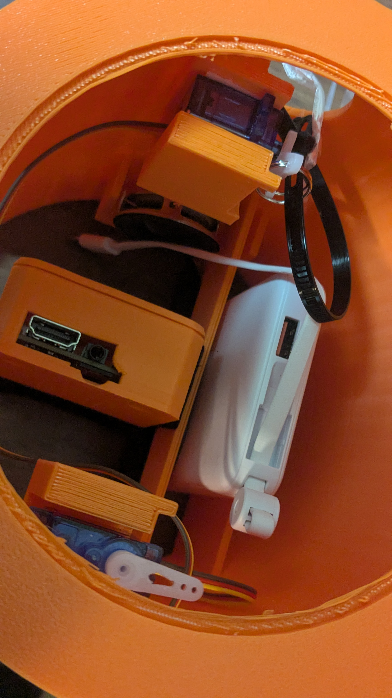

### Wiring

Wired exactly as documented in the repo:

- [docs/wiring.md](../wiring.md) — two power rails (power bank = RDK / LiPo = servos) + **common ground**
- [docs/hardware_block_diagram.md](../hardware_block_diagram.md) — verified pin maps (ESP32-S3 ⇔ eyes)
- [firmware/max98357a](../../firmware/max98357a/) — I2S speaker amp on the 40-pin header (custom kernel driver)

### Software, built with AI

**Let AI write it** — we used Visual Studio Code + Claude Code. (Sorry, we haven't mastered
RDK Studio yet — it can likely do the same, and we'll give it another try!)

### Operation (Korosuke Monitor)

A browser monitor shows speech-recognition results, conversation replies, and **person
presence / skeleton-based motion recognition** in real time.

Open `http://[RDK X5's IP address]:8080/` (the IP depends on your connection and environment).

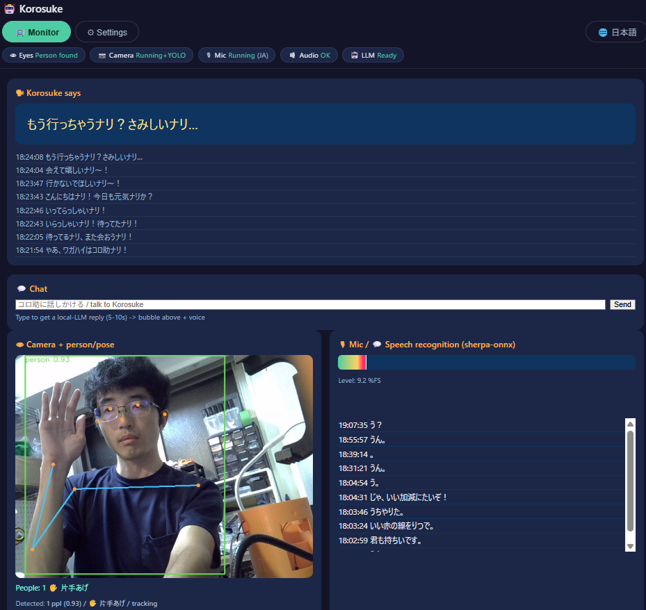

### Tools & jigs

- **Velcro tape** — handy for attaching parts to the 3D-printed body — [Amazon](https://www.amazon.co.jp/dp/B0GJZJM4TG)
- **Ultrasonic cutter** (or an alternative) — handy for post-processing the 3D-printed parts. Look for one on AliExpress — anything that melts plastic works, even a heated metal needle
- **3D printer** — required to print the parts! (we used a **Bambu Lab A1**; parts are within 18 cm, so an **A1 mini** should *just* fit)
- **Double-sided tape** — handy for bonding parts
- **String** — needed to move the hands (rope-pull arms)
- **Zip ties** — needed to tune the rope arms — [Daiso](https://jp.daisonet.com/products/4550480088891)
- **Breadboard (small)** — used for the ESP32-S3 wiring
- **Jumper wires** (M-M / M-F) — used to connect the parts

## Afterword

Robots have become something you can build with just **mechanics + electronics + software**
and a little workshop gear (a bit of soldering, an ultrasonic cutter if needed).

This build took roughly **15 h for the 3D parts + 10 h for electronics & software ≈ 25 hours**.
With the enclosure and parts ready, rebuilding an existing robot is even faster. And for a
somewhat smaller robot — halve the body, print fast (AI designs the enclosure in ~3 h), let AI
write the electronics and software — **a custom robot in one day, maybe ~5 hours, is within reach!**

I am Korosuke!

## Troubleshooting (gotchas)

**① USB-C power is plugged in, but no HDMI output and no USB-C IP link to the PC**
→ Check whether the **green LED next to the USB-C connector is lit**. Perhaps due to
cable/adapter compatibility, the board sometimes silently fails to boot (= green LED off)…

**② No IP connectivity (USB-C / Ethernet)**
→ Configure the network with the [official guide](https://developer.d-robotics.cc/rdk_studio_doc/en/user-guide/network-config/).
RDK Studio may fail to apply the settings, or they may **revert**. Re-run the steps, or open a
terminal over HDMI and check the board's IP with `ip addr`; on Windows check with `ipconfig`
that your interface has an address.

> FYI: this project uses a **static eth0 IP 192.168.0.200** and **192.168.128.10 on the USB-C
> (usb0) gadget link** for maintenance ([docs/network_setup.md](../network_setup.md)).

---
*#RoboticsDreamKeeper #RDKX5 #ROS2 #animatronics*
