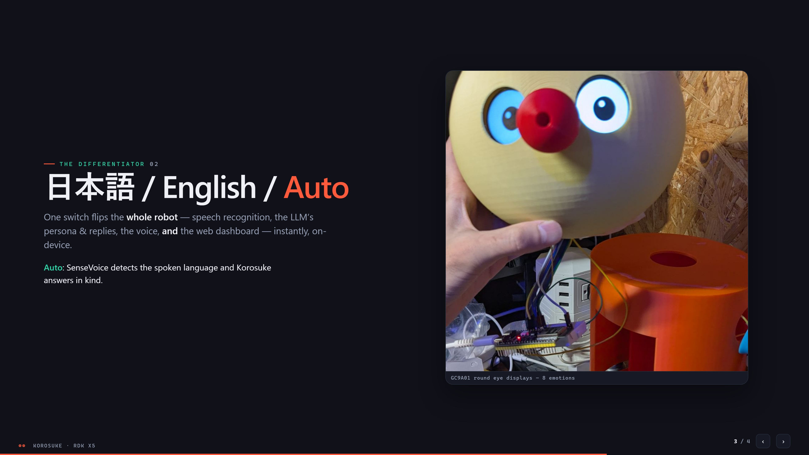
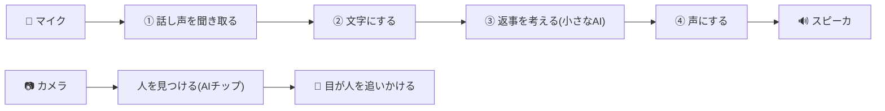

# ワガハイはコロ助ナリ！

> D-Robotics「Robotics Dream Keeper Challenge」参加記(日本語)。
> 英語版のプロジェクト概要は [KazukiMurata-Project-Korosuke.md](../KazukiMurata-Project-Korosuke.md)、技術詳細は [STAGE3.md](../../STAGE3.md) を参照ナリ。

## 目次

- [概要](#概要)
- [背景](#背景)
  - [店長(村田さん)の背景](#店長村田さんの背景)
  - [私(uecken)の背景](#私ueckenの背景)
- [構成](#構成)
  - [ハードウェア構成](#ハードウェア構成)
  - [ソフトウェア構成](#ソフトウェア構成)
- [過程](#過程)
  - [筐体部品をロボスタディオンの3Dプリンタで印刷](#筐体部品をロボスタディオンの3dプリンタで印刷)
  - [電子部品の配線](#電子部品の配線)
  - [ソフトの製作](#ソフトの製作)
  - [コロ助モニタ](#コロ助モニタ)
- [トラブルシューティング(ハマったところ)](#トラブルシューティングハマったところ)
- [あとがき](#あとがき)

## 概要

コロ助は、日本の漫画家・**藤子・F・不二雄**が描く『**キテレツ大百科**』で、発明好きの主人公キテレツが第1話で作る**からくりロボット**です。本プロジェクトのコロ助ロボは、秋葉原のロボットコワーキングスペース「**ロボスタディオン**」のメンバーによる**ファンメイドロボット**——頭脳に **D-Robotics RDK X5** を載せ、**見る・聞く・考える・話す・表情する**をすべて**ボード上だけ**(クラウドなし)で行います。

- デモ動画: https://www.youtube.com/watch?v=NJwj6Iazd20

## 背景

### 店長(村田さん)の背景

東京・秋葉原でアニマトロニクス工房 **Robostadion**([robostadion.com](https://robostadion.com/))を営む村田和樹さん。アニマトロニクスや展示ロボットの製作を生業とし、ESP32/Arduino・Raspberry Pi・Python・OpenSCAD・3Dプリンタの艦隊(!)を日常使いするメイカーです。子どもの頃にロボットを作りたいと思わせてくれたキャラクター——コロ助を、いつかオープンソースのアニマトロニクスとして蘇らせるのが夢でした。

**デザインの元ネタ(inspiration)** — コロ助の設計は次のオープン/アニマトロニクス作品からアイデアを借りています:

- [Disney's Olaf robot](https://thewaltdisneycompany.com/olaf-robotic-character/) — 表情豊かなアニマトロニクスの目と顔
- [Open Duck Mini (BDX)](https://github.com/apirrone/Open_Duck_Mini) — コンパクトな二足歩行ドロイド

### 私(uecken)の背景

私の専門は無線(ワイヤレス)エンジニアリングで、いつか環境に溶け込む「Ambient Robot」を作るのが夢です。ロボット製作は今回が初めて。

店長やスタッフのみなさんが **REK**(秋葉原で開催されるロボットバトル)の準備で大忙しの時期、私も RDK-Challenge に出ようとしていたのですが、仕事の関係で構想だけ描いて手を動かせずにいました。

- REK 概要: https://robostadion.com/rek-tokyo/
- REK 結果: https://robostadion.com/rek-tokyo/report.html

ふとロボスタディオンの Discord を見て、そういえば以前、店長が「コロ助を作らないか！」と声をかけてくれたことを思い出し——**「コロ助を作ろう！」と思い立って近所の秋葉原のロボスタディオンへ**。コロ助の部品を分けてもらい、作らせてもらいました！

<table>
<tr>
<th align="center">村田店長</th>
<th align="center">uecken</th>
</tr>
<tr>
<td></td>
<td></td>
</tr>
</table>

## 構成

### ハードウェア構成

※図中の **C270 はカメラ&マイク兼用**です(内蔵マイクが音声認識の入力)。詳細な結線・ピン表は [docs/wiring.md](../wiring.md) と [docs/hardware_block_diagram.md](../hardware_block_diagram.md) にあります。

### ソフトウェア構成

ぜんぶボードの中だけで動きます(ネット接続なし)。話しかけてから返事まではこの流れ:

1. **話し声を聞き取る** — 人がしゃべっている間だけ耳を傾けます
2. **文字にする** — 聞き取った声を文字に変換(音声認識)
3. **返事を考える** — ボードの中の小さなAIが返事の文章を作ります
4. **声にする** — 文章をコロ助の声でスピーカから話します

同時に、カメラの映像からは**AIチップ(BPU)が人を見つけて、目が人を追いかけます**。返事を考えるのに5〜10秒かかるので、その間は目が「考え中」のアニメになります。

## 過程

### 筐体部品をロボスタディオンの3Dプリンタで印刷

3Dパーツは **店長・村田さんが Claude (Fable 5) を使って設計・製作**！
部品データはリポジトリの [hardware/3d_models/korosuke_print](../../hardware/3d_models/korosuke_print/) にあります(今回使ったのは **v1**。v2以降のフォルダもありますが、まだ試せていません！)。

各部品はこんな構成です:

- **頭**: 半球ふたつ。片方に**目の穴**を開けて、丸型LCDの目を内側から差し込む
- **胴体**: RDK X5・カメラ・スピーカ・サーボモータが収まる円筒。**上下に開口**して部品を出し入れでき、**横には腕を動かすロープアームを通す穴**
- **腕と手**: 輪っかを8個連結して紐を通し、紐の片側を手の先端に、もう一方をサーボモータに接続(＝**ロープアーム**。サーボが紐を引くと腕が持ち上がる)
- **胴体ベース**: 当初ケーブルの出口がなかったので、**超音波カッターで底面をカット**して胴体下から配線を出すように加工
- **足**: 今回は動かさないので、そのまま胴体ベースに接着

### 電子部品の配線

リポジトリの配線資料どおりに接続しました:

- [docs/wiring.md](../wiring.md) — 電源2系統(モバイルバッテリー=RDK / LiPo=サーボ)と**共通GND**の全体図
- [docs/hardware_block_diagram.md](../hardware_block_diagram.md) — ESP32-S3⇔目(GC9A01×2)のピン表・実機検証済みの結線
- [firmware/max98357a](../../firmware/max98357a/) — スピーカ用I2Sアンプ(40ピン直結・カーネルドライバ自作)

### ソフトの製作

**AIに作ってもらいましょう**(今回は Visual Studio Code + Claude Code(Opus 4.8)を利用しています)。RDK Studio はあまり使いこなせていません、ごめんなさい！同じようなことがきっとできると思うので、今度もう一度使ってみます！

### コロ助モニタ

音声認識の結果や会話の返答、そして**人の在/不在検知・骨格推定によるMotion認識**の様子を、ブラウザからリアルタイムで見られるモニタ画面を用意しています。

ブラウザで `http://[RDK X5のIPアドレス]:8080/` を開くと表示されます(IPアドレスは接続方法や環境で変わります)。

## トラブルシューティング(ハマったところ)

**① Type-C電源を挿したのに、HDMI出力もPCとのType-C IP通信もできない**
→ 基板のType-Cコネクタ横の**緑LEDが点いているか**確認しましょう。Type-Cケーブル/アダプタの相性のためか、給電しているつもりでも起動していない(=緑LEDが点かない)ことが何度かありました…。

**② IP通信ができない(Type-C / Ethernet)**
→ ネットワーク設定は[公式手順](https://developer.d-robotics.cc/rdk_studio_doc/en/user-guide/network-config/)で行います。ただ、RDK Studio からうまく設定できていなかったり、**設定が元に戻っていたりする**ことがあります。再度手順を実行するか、HDMIでターミナルを開いて `ip addr` でボード側のIPを確認、Windows側は `ipconfig` で使いたいインターフェースにIPが割り振られているか確認しましょう。

> 参考: このプロジェクトでは保守用に **eth0を固定IP 192.168.0.200**、**USB-C直結(usb0)は192.168.128.10** で運用しています([docs/network_setup.md](../network_setup.md))。

## あとがき

ロボットは「機構・電子・ソフト」と、ちょっとした工作環境(少しのはんだ付け、必要に応じて超音波カッター等)があれば作れる時代になってきました。

今回の製作時間はだいたい **3Dパーツ15時間＋電子・ソフト10時間＝計25時間**。筐体と電子部品が揃っていれば既存ロボットの再現はもっと速いはずです。もう少し小型のロボットで良ければ——筐体サイズを半分にして高速プリント(外観はAI設計で3時間程度)、電子とソフトもAI(Claude Code等)に任せれば、**きっと5時間くらい、1日でカスタムロボットが作れる…はず！**

ワガハイはコロ助ナリ！一緒に夢を作るナリ！

---
*#RoboticsDreamKeeper #RDKX5 #ROS2 #animatronics*
