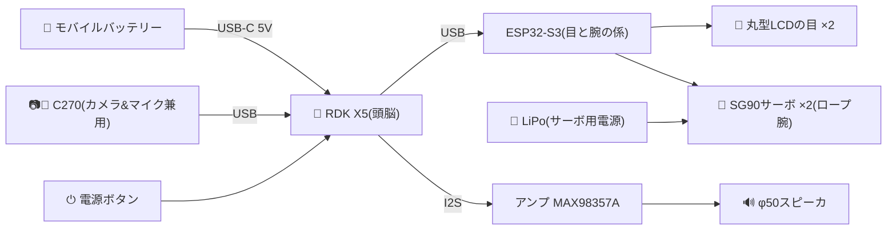
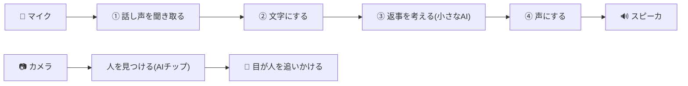
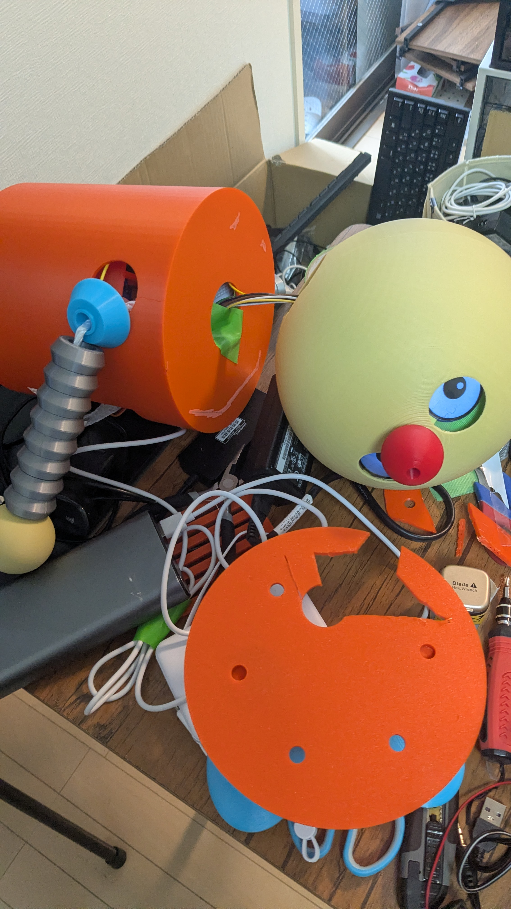

# ワガハイはコロ助ナリ！

> D-Robotics「Robotics Dream Keeper Challenge」参加記(日本語)。
> 英語版のプロジェクト概要は [KazukiMurata-Project-Korosuke.md](../KazukiMurata-Project-Korosuke.md)、技術詳細は [STAGE3.md](../../STAGE3.md) を参照ナリ。

> 🇬🇧 **Key messages (English)** — *presented in Japanese, key points below:*
> - **Korosuke** is a fan-made animatronic of the karakuri robot from *Kiteretsu Daihyakka*, built at **Robostadion** (Akihabara robot co-working space) for the [Robotics Dream Keeper Challenge](https://github.com/D-Robotics/Robotics-Dream-Keeper-Challenge).
> - Everything runs **100% on-device on RDK X5** — BPU vision, speech recognition, local-LLM dialogue, TTS. **No cloud.**
> - This is **my first robot**: Murata-san (Robostadion) invited me, shared the parts, and I built it.
> - The 3D-printed body was **designed with Claude (AI)**; software was also written with AI (VS Code + Claude Code). All files are in this repo.
> - Total build ≈ **25 hours** — with AI assistance, a custom robot in a day is getting realistic.

## 目次

- [概要](#概要)
- [背景](#背景)
- [構成](#構成)
  - [ハードウェア構成](#ハードウェア構成)
  - [ソフトウェア構成](#ソフトウェア構成)
- [過程](#過程)
  - [筐体部品をロボスタディオンの3Dプリンタで印刷](#筐体部品をロボスタディオンの3dプリンタで印刷)
  - [電子部品の配線](#電子部品の配線)
  - [ソフトの製作](#ソフトの製作)
  - [コロ助モニタ](#コロ助モニタ)
- [トラブルシューティング(ハマったところ)](#トラブルシューティングハマったところ)
- [あとがき](#あとがき)

## 概要

*EN: A fan-made Korosuke robot with a D-Robotics RDK X5 brain — it sees, listens, thinks, talks and emotes fully on-device (no cloud).*

コロ助は、日本の漫画家・**藤子・F・不二雄**が描く『**キテレツ大百科**』で、発明好きの主人公キテレツが第1話で作る**からくりロボット**です。本プロジェクトのコロ助ロボは、秋葉原のロボットコワーキングスペース「**ロボスタディオン**」のメンバーによる**ファンメイドロボット**——頭脳に **D-Robotics RDK X5** を載せ、**見る・聞く・考える・話す・表情する**をすべて**ボード上だけ**(クラウドなし)で行います。D-Roboticsの [Robotics Dream Keeper Challenge](https://github.com/D-Robotics/Robotics-Dream-Keeper-Challenge) で製作したものです。

- デモ動画: https://www.youtube.com/watch?v=NJwj6Iazd20

## 背景

*EN: Murata-san (Robostadion, Akihabara) invited me — "why not build Korosuke?" I picked up the parts at his robot co-working space and built my first robot. Design inspired by Disney's Olaf robot and Open Duck Mini (BDX).*

**ロボスタディオン店長(Kazuki Murata [@gurimaruking](https://github.com/gurimaruking) / Robostadion [@robostadion_sin](https://x.com/robostadion_sin))が「コロ助を作らないか！」と声をかけてくれた**

店長やスタッフ達が REK(※1 秋葉原で行われるロボットバトル)の準備で忙しくしており、私も RDK-Challenge に出ようとしていたが仕事の関係で構想だけで作れずにいた。ふとロボスタディオンの Discord を見て、そういえば一度店長が声をかけてくれたことを思い出して、「コロ助を作ろう！」と思い立ち、近所の秋葉原のロボスタディオンへ行き、コロ助の部品をもらって作らせてもらった！

<table>
<tr>
<th align="center">村田店長</th>
<th align="center">uecken</th>
</tr>
<tr>
<td></td>
<td></td>
</tr>
</table>

**inspiration** —

- [Disney's Olaf robot](https://thewaltdisneycompany.com/olaf-robotic-character/) — 表情豊かなアニマトロニクスの目と顔
- [Open Duck Mini (BDX)](https://github.com/apirrone/Open_Duck_Mini) — コンパクトな二足歩行ドロイド

※1 REK-概要 https://robostadion.com/rek-tokyo/ , REK-結果 https://robostadion.com/rek-tokyo/report.html

## 構成

### ハードウェア構成

*EN: RDK X5 (brain) + C270 USB camera & mic + ESP32-S3 co-MCU driving two round-LCD eyes and rope-pull arms + I2S amp & φ50 speaker. Two power rails (power bank for RDK, LiPo for servos) with common ground.*

電源は**2系統**(モバイルバッテリー=RDK X5系 / LiPo=サーボ系)で、GNDは共通にしています。
詳細な配線図スライドは[こちら](../slides/img/korosuke_03.jpg)、結線・ピン表は [docs/wiring.md](../wiring.md) と [docs/hardware_block_diagram.md](../hardware_block_diagram.md) にあります。

### ソフトウェア構成

*EN: Mic → speech-to-text → local LLM → text-to-speech, all on the board. In parallel the BPU (AI chip) detects people so the eyes track you. A reply takes 5–10 s — the eyes show a "thinking" animation meanwhile.*

ぜんぶボードの中だけで動きます(ネット接続なし)。話しかけてから返事まではこの流れ:

1. **話し声を聞き取る** — 人がしゃべっている間だけ耳を傾けます
2. **文字にする** — 聞き取った声を文字に変換(音声認識)
3. **返事を考える** — ボードの中の小さなAIが返事の文章を作ります
4. **声にする** — 文章をコロ助の声でスピーカから話します

同時に、カメラの映像からは**AIチップ(BPU)が人を見つけて、目が人を追いかけます**。返事を考えるのに5〜10秒かかるので、その間は目が「考え中」のアニメになります。

## 過程

### 筐体部品をロボスタディオンの3Dプリンタで印刷

*EN: All body parts were 3D-printed at Robostadion. Murata-san designed them with Claude (AI) — the v1 files are in this repo.*

3Dパーツは **店長・村田さんが Claude (Fable 5) を使って設計・製作**！
部品データはリポジトリの [hardware/3d_models/korosuke_print](../../hardware/3d_models/korosuke_print/) にあります(今回使ったのは **v1**。v2以降のフォルダもありますが、まだ試せていません！)。

各部品はこんな構成です:

- **頭**: 半球ふたつ。片方に**目の穴**を開けて、丸型LCDの目を内側から差し込む
- **胴体**: RDK X5・カメラ・スピーカ・サーボモータが収まる円筒。**上下に開口**して部品を出し入れでき、**横には腕を動かすロープアームを通す穴**
- **腕と手**: 輪っかを8個連結して紐を通し、紐の片側を手の先端に、もう一方をサーボモータに接続(＝**ロープアーム**。サーボが紐を引くと腕が持ち上がる)
- **胴体ベース**: 当初ケーブルの出口がなかったので、**超音波カッターで底面をカット**して胴体下から配線を出すように加工
- **足**: 今回は動かさないので、そのまま胴体ベースに接着

### 電子部品の配線

*EN: Wired following the repo's wiring docs (two power rails + common ground; pin maps verified on the real hardware).*

リポジトリの配線資料どおりに接続しました:

- [docs/wiring.md](../wiring.md) — 電源2系統(モバイルバッテリー=RDK / LiPo=サーボ)と**共通GND**の全体図
- [docs/hardware_block_diagram.md](../hardware_block_diagram.md) — ESP32-S3⇔目(GC9A01×2)のピン表・実機検証済みの結線
- [firmware/max98357a](../../firmware/max98357a/) — スピーカ用I2Sアンプ(40ピン直結・カーネルドライバ自作)

### ソフトの製作

*EN: The software was written with AI — VS Code + Claude Code. (Sorry, I haven't mastered RDK Studio yet — I'll give it another try!)*

**AIに作ってもらいましょう**(今回は Visual Studio Code + Claude Code(Opus 4.8)を利用しています)。RDK Studio はあまり使いこなせていません、ごめんなさい！同じようなことがきっとできると思うので、今度もう一度使ってみます！

### コロ助モニタ

*EN: A browser monitor shows live camera + skeleton, speech-recognition results, replies, and person presence / motion recognition — at `http://[board IP]:8080/`.*

音声認識の結果や会話の返答、そして**人の在/不在検知・骨格推定によるMotion認識**の様子を、ブラウザからリアルタイムで見られるモニタ画面を用意しています。

ブラウザで `http://[RDK X5のIPアドレス]:8080/` を開くと表示されます(IPアドレスは接続方法や環境で変わります)。

## トラブルシューティング(ハマったところ)

*EN: Gotchas — (1) check the green LED next to USB-C: with some cables the board silently doesn't boot; (2) network settings may fail or revert — verify with `ip addr` on the board / `ipconfig` on Windows.*

**① Type-C電源を挿したのに、HDMI出力もPCとのType-C IP通信もできない**
→ 基板のType-Cコネクタ横の**緑LEDが点いているか**確認しましょう。Type-Cケーブル/アダプタの相性のためか、給電しているつもりでも起動していない(=緑LEDが点かない)ことが何度かありました…。

**② IP通信ができない(Type-C / Ethernet)**
→ ネットワーク設定は[公式手順](https://developer.d-robotics.cc/rdk_studio_doc/en/user-guide/network-config/)で行います。ただ、RDK Studio からうまく設定できていなかったり、**設定が元に戻っていたりする**ことがあります。再度手順を実行するか、HDMIでターミナルを開いて `ip addr` でボード側のIPを確認、Windows側は `ipconfig` で使いたいインターフェースにIPが割り振られているか確認しましょう。

> 参考: このプロジェクトでは保守用に **eth0を固定IP 192.168.0.200**、**USB-C直結(usb0)は192.168.128.10** で運用しています([docs/network_setup.md](../network_setup.md))。

## あとがき

*EN: Total build time ≈ 25 h (3D parts 15 h + electronics & software 10 h). With AI design + fast printing + AI-written software, a one-day custom robot is within reach.*

ロボットは「機構・電子・ソフト」と、ちょっとした工作環境(少しのはんだ付け、必要に応じて超音波カッター等)があれば作れる時代になってきました。

今回の製作時間はだいたい **3Dパーツ15時間＋電子・ソフト10時間＝計25時間**。筐体と電子部品が揃っていれば既存ロボットの再現はもっと速いはずです。もう少し小型のロボットで良ければ——筐体サイズを半分にして高速プリント(外観はAI設計で3時間程度)、電子とソフトもAI(Claude Code等)に任せれば、**きっと5時間くらい、1日でカスタムロボットが作れる…はず！**

ワガハイはコロ助ナリ！

---
*#RoboticsDreamKeeper #RDKX5 #ROS2 #animatronics*
