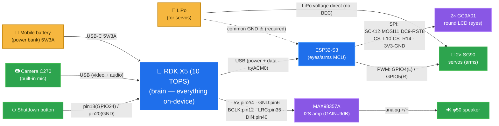
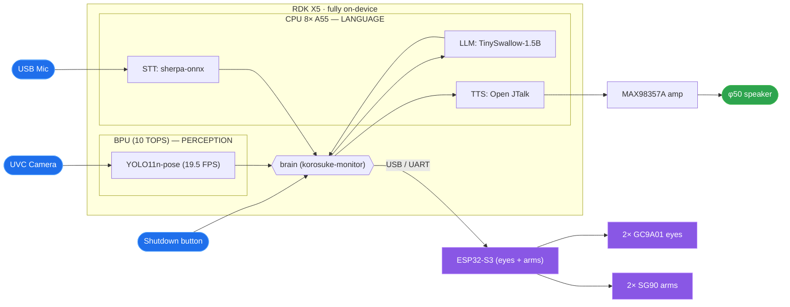

# ワガハイはコロ助ナリ！誰でもロボットを作れる時代

> D-Robotics「Robotics Dream Keeper Challenge」参加記(日本語)。
> 🇬🇧 **English version → [intro_en.md](intro_en.md)** · 技術詳細は [STAGE3.md](../../STAGE3.md) を参照ナリ。

> 🇬🇧 **Key messages (English)** — *presented in Japanese, key points below:*
> - **Korosuke** is a fan-made animatronic of the karakuri robot from *Kiteretsu Daihyakka*, built at **Robostadion** (Akihabara robot co-working space) for the [Robotics Dream Keeper Challenge](https://github.com/D-Robotics/Robotics-Dream-Keeper-Challenge).
> - Everything runs **100% on-device on RDK X5** — BPU vision, speech recognition, local-LLM dialogue, TTS. **No cloud.**
> - This is **my first robot**: Murata-san (Robostadion) invited me, shared the parts, and I built it.
> - The 3D-printed body was **designed with Claude (AI)**; software was also written with AI (VS Code + Claude Code). All files are in this repo.
> - Total build ≈ **25 hours** — with AI assistance, a custom robot in a day is getting realistic.

## 目次

- [はじめに](#はじめに)
- [背景](#背景)
- [構成](#構成)
  - [ハードウェア構成](#ハードウェア構成)
  - [ソフトウェア構成](#ソフトウェア構成)
- [製作過程](#製作過程)
  - [機構(3Dパーツ設計/3Dプリント/筐体配置)](#機構3dパーツ設計3dプリント筐体配置)
  - [電子部品配線](#電子部品配線)
  - [ソフトウェア製作](#ソフトウェア製作)
  - [運用(コロ助モニタ)](#運用コロ助モニタ)
  - [製作治具](#製作治具)
- [あとがき](#あとがき)
- [トラブルシューティング(ハマったところ)](#トラブルシューティングハマったところ)

## はじめに

*EN: A fan-made Korosuke robot with a D-Robotics RDK X5 brain, designed and built together with AI (mechanics / electronics / software) — it sees, listens, thinks, talks and emotes fully on-device (no cloud). An era when anyone can build their own robot is surely coming!*

コロ助は、日本の漫画家・**藤子・F・不二雄**が描く『**キテレツ大百科**』で、発明好きの主人公キテレツが作るパートナーの**からくりロボット**です。本プロジェクトのコロ助ロボは、秋葉原のロボットコワーキングスペース「**ロボスタディオン**」のメンバーによる**ファンメイドロボット**——頭脳に **D-Robotics RDK X5** を載せ、**AIと共に機構/電子/ソフトの設計**をし、3Dプリント/部品接続/ソフト実装を行い、**見る・聞く・考える・話す・表情する**をすべて**ボード上だけ**(クラウドなし)で行い、D-Roboticsの [Robotics Dream Keeper Challenge](https://github.com/D-Robotics/Robotics-Dream-Keeper-Challenge) で製作したものです。これからは誰でも好きなロボットを作れる時代がきっと来るでしょう！

- デモ動画: https://www.youtube.com/watch?v=NJwj6Iazd20

## 背景

*EN: Murata-san (Robostadion, Akihabara) invited me — "why not build Korosuke?" I picked up the parts at his robot co-working space and built my first robot. Design inspired by Disney's Olaf robot and Open Duck Mini (BDX).*

**ロボスタディオン店長(Kazuki Murata [@gurimaruking](https://github.com/gurimaruking) / Robostadion [@robostadion_sin](https://x.com/robostadion_sin))が「コロ助を作らないか！」と声をかけてくれた**

店長やスタッフ達が REK(※1 秋葉原で行われるロボットバトル)の準備で忙しくしており、私も RDK-Challenge に出ようとしていたが、諸事情により構想だけ終わってしまっていた。ふとロボスタディオンの Discord を見て、そういえば一度店長が声をかけてくれたことを思い出し、近所の秋葉原のロボスタディオンへ行き、コロ助の部品をもらって作らせてもらいました。

<table>
<tr>
<th align="center">村田店長</th>
<th align="center">uecken</th>
</tr>
<tr>
<td></td>
<td></td>
</tr>
</table>

**inspiration** —

- [Disney's Olaf robot](https://thewaltdisneycompany.com/olaf-robotic-character/) — 表情豊かなアニマトロニクスの目と顔
- [Open Duck Mini (BDX)](https://github.com/apirrone/Open_Duck_Mini) — コンパクトな二足歩行ドロイド

※1 REK-概要 https://robostadion.com/rek-tokyo/ , REK-結果 https://robostadion.com/rek-tokyo/report.html

## 構成

### ハードウェア構成

*EN: RDK X5 (brain) + C270 USB camera & mic + ESP32-S3 co-MCU driving two round-LCD eyes and rope-pull arms + I2S amp & φ50 speaker. Two power rails (power bank for RDK, LiPo for servos) with common ground.*

**Legend**: 🟡 Power · 🔵 Compute (board) · 🟣 Module · 🟢 Peripheral(配線のラベルはピン番号)

電源は**2系統**(モバイルバッテリー=RDK X5系 / LiPo=サーボ系)で、GNDは共通にしています。
詳細な配線図スライドは[こちら](../slides/img/korosuke_03.jpg)、結線・ピン表は [docs/wiring.md](../wiring.md) と [docs/hardware_block_diagram.md](../hardware_block_diagram.md) にあります。

### ソフトウェア構成

*EN: A central "brain" (korosuke-monitor) orchestrates everything on the board: mic → speech-to-text → local LLM → text-to-speech for conversation, the BPU (AI chip) detects people so the eyes track you, and the same brain drives the eyes/arms via the ESP32-S3. A reply takes 5–10 s — the eyes show a "thinking" animation meanwhile.*

ぜんぶボードの中だけで動きます(ネット接続なし)。図の中央にいる **brain(korosuke-monitor)** がコロ助の司令塔で、耳・頭・口・目・腕をこう束ねています:

- 👂 **聞く** — マイクの声を文字に変換(音声認識 STT)して司令塔へ
- 🧠 **考える** — 司令塔がボード内の小さなAI(ローカルLLM)に返事の文章を作らせる
- 🗣 **話す** — 文章をコロ助の声に変換(TTS)し、アンプ経由でスピーカから再生
- 👀 **見る** — カメラ映像は**AIチップ(BPU)**が人を検出。司令塔が目に「そっちを見て」と指示
- 💪 **動かす** — 司令塔がESP32-S3に指示を送り、目の表情(8種類)と腕を動かす
- ⏻ **電源ボタン** — 押すと「おやすみ」と言って✕✕目になり、安全にシャットダウン

返事を考えるのに5〜10秒かかるので、その間は目が「考え中」のアニメになります。

## 製作過程

### 機構(3Dパーツ設計/3Dプリント/筐体配置)

*EN: All body parts were 3D-printed at Robostadion. Murata-san designed them with Claude (AI) — the v1 files are in this repo.*

3Dパーツは **店長・村田がAIと共同製作**。
部品データはリポジトリの [hardware/3d_models/korosuke_print](../../hardware/3d_models/korosuke_print/) にあります(今回使ったのは **v1**。v2以降のフォルダもありますが、まだ試せていません！)。

各部品の詳細は下記。

- **頭**: 半球二つ。片方に**目の穴**を開けて、丸型LCDの目を内側から差し込む
- **胴体**: RDK X5・カメラ・スピーカ・サーボモータが収まる円筒。**上下に開口**して部品を出し入れでき、**横には腕を動かすロープアームを通す穴**
- **腕と手**: 輪っかを8個連結して紐を通し、紐の片側を手の先端に、もう一方をサーボモータに接続(＝**ロープアーム**。サーボが紐を引くと腕が持ち上がる)
- **胴体ベース**: 当初ケーブルの出口がなかったので、**超音波カッターで底面をカット**して胴体下から配線を出すように加工
- **足**: 今回は動かさないので、そのまま胴体ベースに接着

### 電子部品配線

下記参照。

- [docs/wiring.md](../wiring.md) — 電源2系統(モバイルバッテリー=RDK / LiPo=サーボ)と**共通GND**の全体図
- [docs/hardware_block_diagram.md](../hardware_block_diagram.md) — ESP32-S3⇔目(GC9A01×2)のピン表・実機検証済みの結線

### ソフトウェア製作

*EN: Create it together with AI — you place the parts and debug, becoming the eyes and hands AI doesn't have, and build the robot together!*

**AIと一緒に創りましょう**。あなたが部品配置やデバッグをして、AIが補えない眼や手となってロボットを作ります！

### 運用(コロ助モニタ)

*EN: A browser monitor shows live camera + skeleton, speech-recognition results, replies, and person presence / motion recognition — at `http://[board IP]:8080/`.*

音声認識の結果や会話の返答、そして**人の在/不在検知・骨格推定によるMotion認識**の様子を、ブラウザからリアルタイムで見られるモニタ画面を用意しています。

ブラウザで `http://[RDK X5のIPアドレス]:8080/` を開くと表示されます(IPアドレスは接続方法や環境で変わります)。

### 製作治具

*EN: Tools — velcro tape, an ultrasonic cutter (or an alternative), and a 3D printer (we used a Bambu Lab A1; the parts are within 18 cm, so an A1 mini should just fit).*

- **マジックテープ**(RDK X5やバッテリーの固定用) — [Amazon](https://www.amazon.co.jp/dp/B0GJZJM4TG)
- **超音波カッター**(または代替の切削工具) — ベースのケーブル出口加工に使用
- **3D Printer** — 今回は **Bambu Lab A1** を利用(パーツは18cm以内のため、**A1 miniでもぎりぎり印刷できるはず**)

## あとがき

*EN: Total build time ≈ 25 h (3D parts 15 h + electronics & software 10 h). With AI design + fast printing + AI-written software, a one-day custom robot is within reach.*

ロボットは「機構・電子・ソフト」と、ちょっとした工作環境(少しのはんだ付け、必要に応じて超音波カッター等)があれば作れる時代になってきました。

今回の製作時間はだいたい **3Dパーツ15時間＋電子・ソフト10時間＝計25時間**。筐体と電子部品が揃っていれば既存ロボットの再現はもっと速いはずです。もう少し小型のロボットで良ければ——筐体サイズを半分にして高速プリント(外観はAI設計で3時間程度)、電子とソフトもAI(Claude Code等)に任せれば、**きっと5時間くらい、1日でカスタムロボットが作れる…はず！**

ワガハイはコロ助ナリ！

## トラブルシューティング(ハマったところ)

*EN: Gotchas — (1) check the green LED next to USB-C: with some cables the board silently doesn't boot; (2) network settings may fail or revert — verify with `ip addr` on the board / `ipconfig` on Windows.*

**① Type-C電源を挿したのに、HDMI出力もPCとのType-C IP通信もできない**
→ 基板のType-Cコネクタ横の**緑LEDが点いているか**確認しましょう。Type-Cケーブル/アダプタの相性のためか、給電しているつもりでも起動していない(=緑LEDが点かない)ことが何度かありました…。

**② IP通信ができない(Type-C / Ethernet)**
→ ネットワーク設定は[公式手順](https://developer.d-robotics.cc/rdk_studio_doc/en/user-guide/network-config/)で行います。ただ、RDK Studio からうまく設定できていなかったり、**設定が元に戻っていたりする**ことがあります。再度手順を実行するか、HDMIでターミナルを開いて `ip addr` でボード側のIPを確認、Windows側は `ipconfig` で使いたいインターフェースにIPが割り振られているか確認しましょう。

> 参考: このプロジェクトでは保守用に **eth0を固定IP 192.168.0.200**、**USB-C直結(usb0)は192.168.128.10** で運用しています([docs/network_setup.md](../network_setup.md))。

---
*#RoboticsDreamKeeper #RDKX5 #ROS2 #animatronics*
