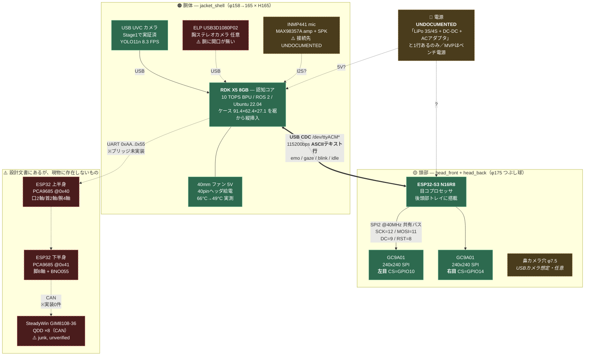
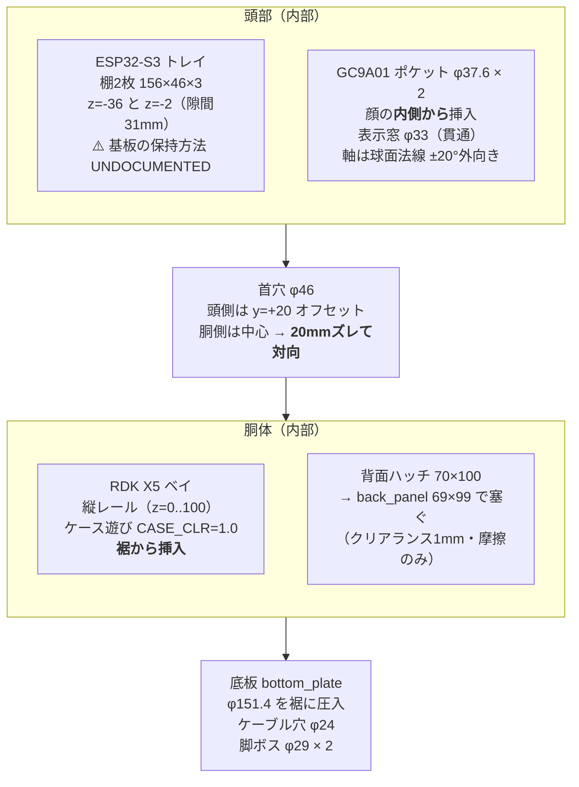
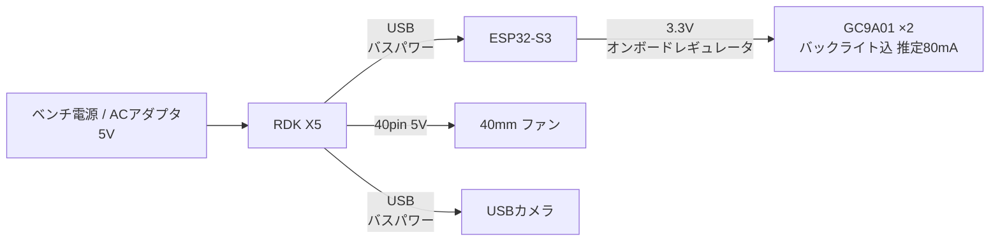

# Korosuke — ハードウェア ブロック図

> **この文書の性格:** 既存の設計文書には「論理データフロー図」しか無く、**電装の結線・電源・実装レイアウトを示す図が存在しなかった**ため、
> **現物ソース（`.scad` / firmware / ros2_ws）から逆算して起こしたもの**です。
> 記載は全て `file:line` で裏付けています。**推測は「推定」と明記**し、ソースに無いものは **UNDOCUMENTED** と書いています。
>
> 作成: 2026-07-17 / 対象リビジョン: `main` (c599c68)

## 凡例

| 表記 | 意味 |
|---|---|
| **実線** | ソースで実装・機構を確認済み。**現物に存在する** |
| **破線 / ⚠️** | ドキュメントには書かれているが、**実装または機構が存在しない** |
| **UNDOCUMENTED** | どこにも記載が無く、引き継ぐ人が決める必要がある |

---

## 1. 全体ブロック図



---

## 1.5 実機検証結果（2026-07-18）

**目サブシステムはエンドツーエンドで動作確認済み**: リポジトリのソースをビルド → ESP32-S3へ書き込み →
2× GC9A01にアイドルアニメ表示 → ホストから `ping`→`pong` / `emo happy` / `gaze` / `blink` が全て機能。
配線（SPI共有バス+CS分離、3.3V給電）は第3章の表の通りで正しいことを実機で確認した。

> ⚠️ **Windows運用上の罠(実測)**: ESP32-S3の**ネイティブUSBポート**(VID_303A&PID_1001)は、
> Windowsの標準シリアルAPIで開くと**チップがDOWNLOADモードにリセットされる**(rst:0x15, boot:0x0 を確認)。
> Windowsからのモニタ/コマンドは**CH343側USB-C**(VID_1A86)を使うこと。ファームはUART0(CH343)からも
> 診断出力とコマンド入力を受ける(main.cppのSerial0)。
> ※RDK X5(Linux)からの接続は`serial_bridge_node`が`/dev/ttyACM*`(ネイティブUSB)を掴む設計 —
> Linuxで同じ罠が出るかは**統合時に要確認**。出る場合はCH343側(`/dev/ttyUSB*`)に切替可能。

> 🔊 **音響系の検証(2026-07-19, 再判定済)**: スピーカー(ES8326→3.5mm→アンプ内蔵SP)**動作**。
> **カメラ内蔵マイクも生きている** — スピーカー電源ONの再テストでビープ/音声を音響的に捕捉
> (一時「故障」と誤診したが、原因はテスト中スピーカーの電源がOFFで音源が存在しなかったこと)。
> ES8326のcaptureは**再生のサイドトーンのみ**(物理マイク無し。エコーキャンセルの参照信号として利用価値あり)。
> 音量は`amixer -c duplexaudio sset 'DAC' <n>%`(plughw直叩きはPulseAudio素通り、デスクトップ音量無効)。
> ⚠️ ALSAカード番号は再起動で入れ替わる — デバイスは番号でなく**名前**(`plughw:Microphone,0` / `plughw:duplexaudio,0`)で指定すること。
> ⚠️ vosk小型jaモデルはノイズ入力から「えーっと」等を幻聴する — 無音時の認識結果は信用しない(VAD必須)。

> ✅ **RDK X5側も検証済(2026-07-18夕)**: SSH(`sunrise@192.168.128.10`) → BPU YOLO11nライブ**19.5 FPS** /
> USBカメラ(Sunplus FHD, マイク内蔵)で録音+vosk日本語STT動作 / ESP32-S3を**CH343側**でRDKに接続すると
> `/dev/ttyACM0`として見え、**Linuxではリセット罠は発生しない**(pyserial直開きでpong応答) /
> `serial_bridge`+`eye_demo`によるROS 2→目の8表情巡回をユーザー目視で確認(**M2達成**)。

> 📝 **ビルド環境の修理履歴(2026-07-18)**: このPCの`framework-arduinoespressif32`パッケージは
> esp32s3 SDKが丸ごと欠落する破損状態だった(platformio.iniの「ManifestError」注記の実体)。
> パッケージ再取得で解消。LovyanGFXは1.1.16に完全固定した(^指定だと1.2.xが入り既知構成から乖離)。

## 2. 実在する信号経路（実装確認済み）

| # | 経路 | 物理層 | プロトコル | 根拠 |
|---|---|---|---|---|
| 1 | RDK X5 → ESP32-S3 | **USB CDC**（`/dev/ttyUSB*` / `/dev/ttyACM*` を自動選択） | **ASCIIテキスト行** 115200bps | [serial_bridge_node.py:44](../ros2_ws/src/korosuke_nodes/korosuke_nodes/serial_bridge_node.py#L44), [:71](../ros2_ws/src/korosuke_nodes/korosuke_nodes/serial_bridge_node.py#L71) |
| 2 | ESP32-S3 → GC9A01 ×2 | SPI2_HOST @ 40MHz、**バス共有・CS分離** | LovyanGFX `Panel_GC9A01` | [corosuke_eyes/main.cpp:31-36](../firmware/corosuke_eyes/src/main.cpp#L31-L36), [:48-51](../firmware/corosuke_eyes/src/main.cpp#L48-L51) |
| 3 | カメラ → RDK X5 | USB (UVC) | V4L2 | [STAGE1.md](../STAGE1.md), [scripts/cam_yolo.py](../scripts/cam_yolo.py) |
| 4 | ファン → RDK X5 | 40pinヘッダ 5V | — | [stage2_design.md:121](stage2_design.md#L121) |

### 2.1 コマンド語彙（RDK X5 → 目）

`serial_bridge_node` が `/korosuke/eye_cmd` (`korosuke_msgs/EyeCmd`) を購読し、**差分のみ**を1行ずつ書き込みます（[serial_bridge_node.py:80-92](../ros2_ws/src/korosuke_nodes/korosuke_nodes/serial_bridge_node.py#L80-L92)）:

```
emo <neutral|happy|sad|angry|surprised|sleepy>
gaze <x> <y>            # -1.0 .. 1.0
blink
wink <l|r>
idle <on|off>
ping                    -> "pong"
```

---

## 3. ESP32-S3 ピンアサイン（実装済み・唯一の正）

[firmware/corosuke_eyes/src/main.cpp:31-38](../firmware/corosuke_eyes/src/main.cpp#L31-L38) が唯一の正しいピン定義です。
**`firmware/common/config.h` は参照しないでください**（第6章参照）。

| 信号 | GPIO | 接続先 | 備考 |
|---|---|---|---|
| SCK | **12** | 両目共有 | SPI2_HOST, 40MHz |
| MOSI | **11** | 両目共有 | MISO は未使用 (-1) |
| DC | **9** | 両目共有 | |
| RST | **8** | 両目共有（物理結線） | **左目のみが駆動**。右目は `pin_rst=-1` |
| CS 左 | **10** | 左目のみ | |
| CS 右 | **14** | 右目のみ | |
| UART1 RX | 18 | ← RDK X5 TX | **実装済みだが現在未使用**（ブリッジはUSB経由） |
| UART1 TX | 17 | → RDK X5 RX | 同上 |

> ⚠️ **ハード上の注意（ファームのコメントに明記あり）:**
> GC9A01モジュール（M128-240240-RGB-7-V1.0）の **CSはプルダウン＝常時選択**。
> 2枚を1バスに繋ぐ場合、**両方のCSをGPIOで駆動しないと描画が衝突します**。
> このファームはそれを行っています（[main.cpp:13-14](../firmware/corosuke_eyes/src/main.cpp#L13-L14)）。

---

## 4. 実装レイアウト（どこに何が載るか）



| 部位 | 寸法 | 根拠 |
|---|---|---|
| ESP32-S3 トレイ | 棚2枚 `156×46×3`、z=`-36`/`-2`（**隙間31mm**） | [korosuke_print.scad:138-144](../hardware/3d_models/korosuke_print/korosuke_print.scad#L138-L144) |
| GC9A01 ポケット | φ**37.6** × 深さ（底=中心面-3.4）、窓φ**33** | [:65-70](../hardware/3d_models/korosuke_print/korosuke_print.scad#L65-L70), [:99-108](../hardware/3d_models/korosuke_print/korosuke_print.scad#L99-L108) |
| 首穴（頭側） | φ**46**、`translate([0,20,...])` = **y+20オフセット** | [:127](../hardware/3d_models/korosuke_print/korosuke_print.scad#L127) |
| 首穴（胴側） | φ**46**、中心 | [:195](../hardware/3d_models/korosuke_print/korosuke_print.scad#L195) |
| RDK X5 ベイ | レール間 = `CASE_D(62.4) + CLR(1.0)`、高さ100 vs ケース91.4 | [:73-74](../hardware/3d_models/korosuke_print/korosuke_print.scad#L73-L74), [:197-206](../hardware/3d_models/korosuke_print/korosuke_print.scad#L197-L206) |
| 背面ハッチ | 開口 70×100 / 蓋 69×99 | [:209](../hardware/3d_models/korosuke_print/korosuke_print.scad#L209), [:221](../hardware/3d_models/korosuke_print/korosuke_print.scad#L221) |
| ケーブル穴（底板） | φ24 | [:232](../hardware/3d_models/korosuke_print/korosuke_print.scad#L232) |
| スピーカーグリル | φ4 × 15穴（前面下部） | [:211-212](../hardware/3d_models/korosuke_print/korosuke_print.scad#L211-L212) |

---

## 5. 電源系統 — **未設計**

**リポジトリ全体に電源設計は存在しません。** 記載は以下の2箇所のみ:

- [stage2_design.md:140](stage2_design.md#L140) — `Power | LiPo 3S/4S + DC-DC + AC adapter | — | ✅ in stock`
- [stage2_design.md:184](stage2_design.md#L184) — R7: `separate LiPo rail + DC-DC per [inventory.md]; MVP runs on bench PSU`
  → **参照先の `docs/inventory.md` は存在しません**（`docs/bom.md` も同様）

### 推定される最小構成（※ソース上の断片からの推定・要検証）

現在の実装（ブリッジがUSBを掴む）から素直に読むと、MVPの電源ツリーはこうなるはずです:



つまり **RDK X5に5Vを1本入れれば全系統が動く**可能性が高く、これがMVPの最短経路です。
ただし**これはソースに書かれていない推定**であり、RDK X5のUSBポートの給電能力と実測消費で確認が必要です。

---

## 6. ドキュメントとの相違（**重要**）

引き継ぎ時に**そのまま信じると詰まる**箇所です。

| # | ドキュメントの記述 | 実際 | 影響 |
|---|---|---|---|
| **D1** | [stage2_design.md:100-102](stage2_design.md#L100-L102) —「`protocol.h` (0xAA…0x55) をワイヤフォーマットとして**維持**し、`serial_bridge_node` がROS2メッセージをそれにシリアライズする」 | **嘘。** `serial_bridge_node` は **ASCIIテキスト行**を書いている（`emo happy\n`）。目ファームは `protocol.h` を **include すらしていない** | 0xAA..0x55 を前提に実装すると**全く通信できない** |
| **D2** | [config.h](../firmware/common/config.h) — 目H/V・まぶた・口・首・腕・脚の20軸以上のサーボ定義 | **旧アーキテクチャの化石。** 現行の印刷設計にこれらの機構は**1つも存在しない**。ピンも目ファームと無関係 | ピン表として参照すると**全て間違う** |
| **D3** | [config.h:115,119](../firmware/common/config.h#L115-L119) | `I2S_DIN_PIN 9` と `MIC_SD_PIN 9` が**衝突**（別バス定義なのに9番共有） | 音声を2バス構成で組むと破綻 |
| **D4** | [PRINT_GUIDE.md:47](../hardware/3d_models/korosuke_print/PRINT_GUIDE.md#L47) / korosuke_print/README.md —「前後割り**+ピン4**」 | **ピンは存在しない。** `locpin()`/`locpin_hole()` は[:89-90](../hardware/3d_models/korosuke_print/korosuke_print.scad#L89-L90)で**定義のみ・呼び出し0回**。合わせはリップ(`LIP_H=6`)だけ | 頭の位置決めを別途考える必要 |
| **D5** | [PRINT_GUIDE.md:56](../hardware/3d_models/korosuke_print/PRINT_GUIDE.md#L56) —「胴に外から当ててM2×4でネジ止め」 | **胴に穴が無い。** `chest_cut()` は[chest_cam.scad:68-71](../hardware/3d_models/stereo_cam/chest_cam.scad#L68-L71)に「jacket統合用」として定義されているが、`jacket_shell` に**適用されていない**。2ファイルは `use<>` で連携すらしていない | 胸カメラは**取付不可**（統合作業が必要） |
| **D6** | [README.md:80](../README.md#L80) / [stage2_design.md:128](stage2_design.md#L128) が `docs/bom.md` `docs/inventory.md` を参照 | **両方存在しない** | 電源・部品の参照先が消失 |
| **D7** | [korosuke_print/README.md:22](../hardware/3d_models/korosuke_print/README.md#L22) — 腕=紺青A/B交互リング、頭/胴=橙 | **古い。** 現行は `PALETTE="anime"`（[:36](../hardware/3d_models/korosuke_print/korosuke_print.scad#L36)）で頭=淡黄/胴=橙、腕=**水色単色×16**。`preview_iso.png` も旧配色のまま | 配色を間違えて印刷する |
| **D8** | [README.md:35](../README.md#L35) — 2軸マウスのリップシンク / 首の追従 (G2) | **機構が存在しない。** 口は固定スリット（[:118-119](../hardware/3d_models/korosuke_print/korosuke_print.scad#L118-L119)）、首サーボ無し、頭と胴を留める機構すら無い | リップシンク・首追従は**未設計** |
| **D9** | [README.md:35](../README.md#L35) 二足歩行 / [stage2_design.md:139](stage2_design.md#L139) QDD×8 (CAN) | **脚の設計が3つ食い違う。** ①現物=φ36中空パイプ・関節0 ②firmware=PWMサーボ9軸 ③BOM=CAN QDD×8。CANの実装は**リポジトリ全体で0件**（TWAI/MCP2515/トランシーバ全て無し）。GIM8108は推定φ90でLEG_D=36に**物理的に入らない** | 脚は**スコープ外**として扱うのが妥当 |

---

## 7. 現物に存在する基板の全リスト

| 基板 | 搭載位置 | 接続 | 状態 |
|---|---|---|---|
| **RDK X5 8GB** | 胴内・縦置きベイ（裾から挿入） | 5V入力 / USB×N / 40pin | ✅ 実機動作（Stage1） |
| **ESP32-S3 N16R8** | 後頭部トレイ | USB ← RDK X5 | ✅ ファーム実装済 |
| **GC9A01 ×2** | 顔の内側ポケット φ37.6 | SPI ← ESP32-S3 | ✅ ファーム実装済 |
| **USBカメラ** | 鼻穴 φ7.5 or 胸（※胸は取付不可） | USB ← RDK X5 | ✅ Stage1実証 |
| **40mmファン** | RDK X5ケース蓋 | 40pin 5V | ✅ 実測 −17°C |
| INMP441 / MAX98357A | UNDOCUMENTED | UNDOCUMENTED | ⚠️ 接続先未設計 |

**退役扱い（現物と対応しない）:** `firmware/corosuke_main`（[stage2_design.md:194](stage2_design.md#L194) が明示的に retire）、`firmware/corosuke_upper`、`firmware/corosuke_lower`、`firmware/common/config.h`、`firmware/common/protocol.h`

---

## 8. 引き継ぎ者が決める必要があるもの

1. **電源** — 5V単一で足りるか。バッテリ運用するか、ベンチ電源のままか
2. **ESP32-S3の保持方法** — トレイは隙間31mmの棚2枚のみ。ネジ/タイラップ/両面テープのいずれか
3. **頭と胴の固定** — 現状、機構が無い（頭は載っているだけ）
4. **音声の接続先** — RDK X5のI2Sか、ESP32-S3に相乗りさせるか
5. **胸カメラを使うか** — 使うなら `jacket_shell` に `chest_cut()` を統合する作業が必要
6. **口/首/腕/脚を動かすか** — 動かすなら機構から新規設計（現行は全て静的）

---

*この文書は現物ソースから機械的に起こしたものです。矛盾を見つけたら、`.scad` / firmware を正とし、この文書を修正してください。*
