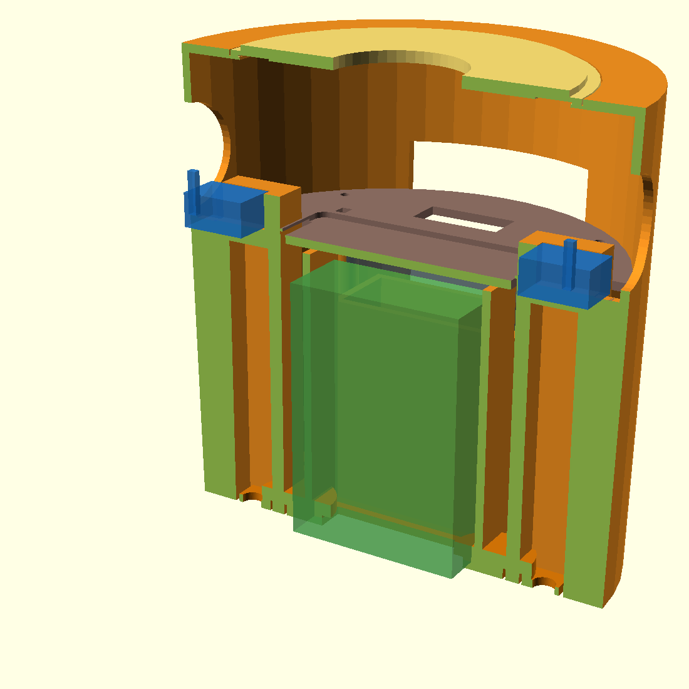
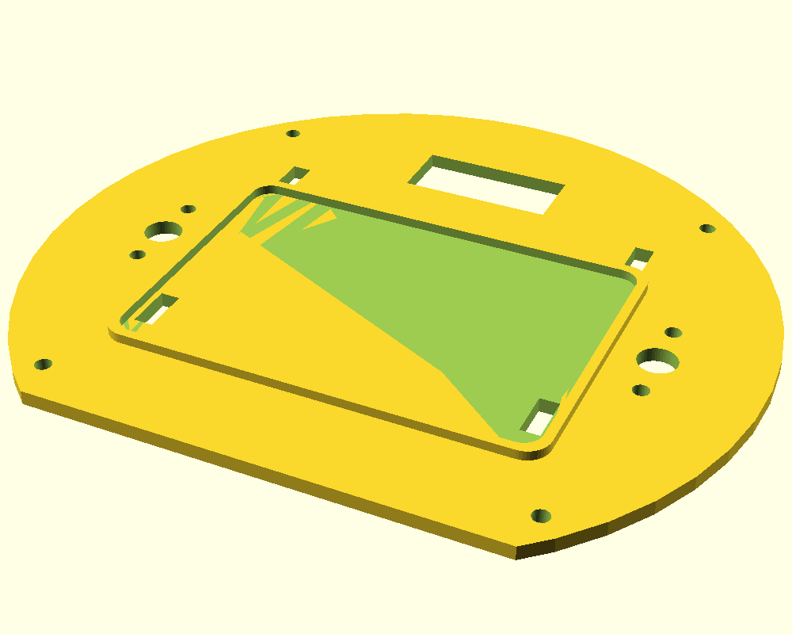
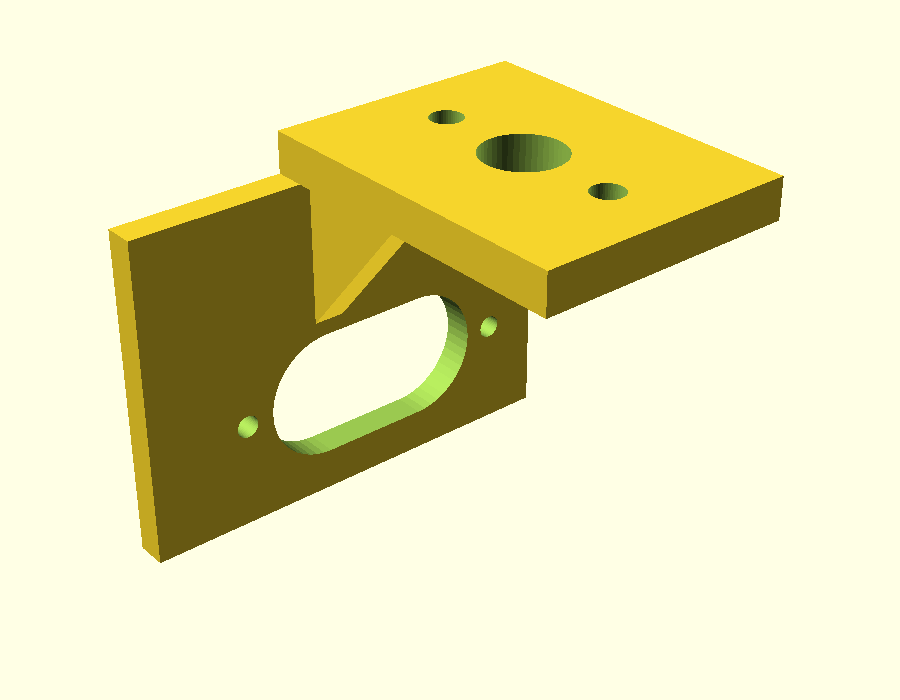
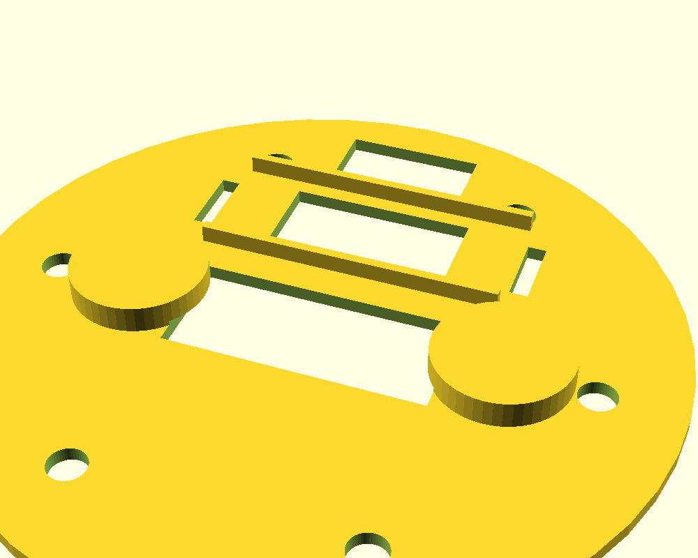
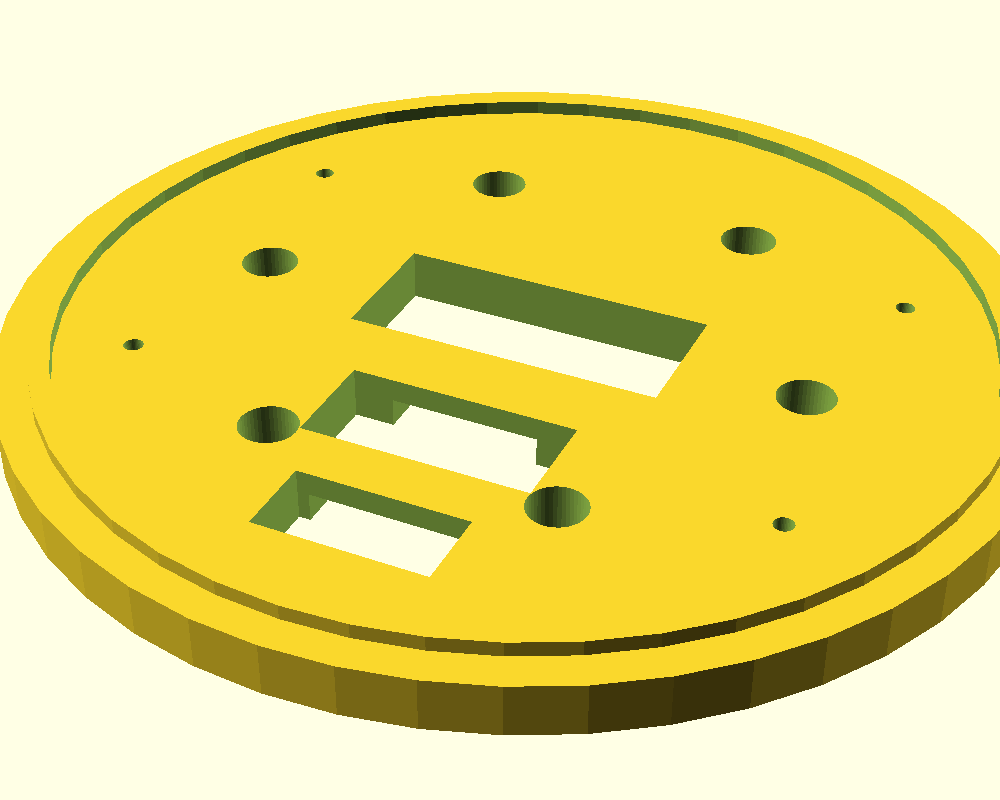

# 胴体 v2 設計 — 実装レイアウト再設計 (2026-07-27)

ソース: [hardware/3d_models/korosuke_print/torso_v2.scad](../hardware/3d_models/korosuke_print/torso_v2.scad)
外形は v1 `jacket_shell` と互換（H165 / 裾φ158 / 上φ165 / 壁3、ハッチ・ボタン穴・腕穴・グリル同位置）。
**頭・襟・背面パネル・腕・脚は v1 のまま使えます。**



## 要件 → 実装

| 要件 | 実装 |
|---|---|
| SG90×2 でロープアームを引く（ネジ止め） | **腕穴直下のシェル一体コの字タワー**（実機レイアウト準拠・2026-07-28変更）。上開放スロットに**上から落とし込み→内側タブを前面から付属M2×1**（外側タブは腕穴上のため無し・コの字が本体を拘束）。**軸(±68, z112)・ホーン真上で先端が腕穴中心(z127)** → ロープは腕の中心軸からそのままホーンへ。**軸側の端を外側=腕穴側に向ける**（左右で逆）。ホーンは「真上→内側」の範囲のみ使用（外側へ回すと壁干渉）。旧デッキ吊りブラケット(SHOW=4)はオプション |
| RDK X5 筐体が入る | v1 と同じ **縦置きレール**（91.4×62.4×27.1 +遊び1mm、前面寄り） |
| モバイルバッテリー | 背面に **縦置きトレイ**（既定 62×24、`PB_W/PB_T` で変更可）。上開放・底板にベルクロスロット |
| ESP32-S3 & ブレッドボード | **頭部に移設**（2026-07-28決定）。中段デッキは**上から物を入れる棚**として存続（ブレッドボード枠は将来用に温存） |
| 上から物を入れる | 天板廃止 → **φ118 開口 + 落とし込みリッド**（首穴φ46・指掛かり2箇所）。頭ごと持ち上げれば胴内デッキに手が届く |
| USB 4本を下から出す | 底板に **RDK窓 56×24 / バッテリー窓 / 背面スロット**。フットベースにも同位置の窓＋**裏面排線溝**（ベタ置きのまま背面へ） |
| 胸カメラ | 前面 z=100 に **32×32/38×38 UVC基板ポケット**（M2ボス×4・ピッチ28、10°上向き）＋ **レンズ窓φ12＋すり鉢面取り**（M12レンズ先端φ10・100°ケラレ防止）＋マイク導音孔×3 |
| フットベース | 現状アクリル両面テープ固定 → v2 は **裾ズレ止め土手＋テープゾーン＋M3×4 共締め穴**（皿もみ）。両面テープ運用のままでも可 |

## パーツ一覧（SHOW番号）

| SHOW | パーツ | 色 | 個数 | STL |
|---|---|---|---|---|
| 1 | jacket_shell_v2 | 🟠橙 | 1 | `v2/orange/jacket_shell_v2_x1.stl` |
| 2 | bottom_plate_v2 | 🟠橙 | 1 | `v2/orange/bottom_plate_v2_x1.stl` |
| 3 | mid_deck | ⚪灰 | 1 | `v2/gray/mid_deck_x1.stl` |
| 4 | servo_bracket | ⚪灰 | **2**（左右共通） | `v2/gray/servo_bracket_x2.stl` |
| 5 | top_lid | 🟠橙 | 1 | `v2/orange/top_lid_x1.stl` |
| 6 | cam_bezel | 🔴赤 | 1 | `v2/red/cam_bezel_x1.stl` |
| 7 | foot_base_v2 | ⚪灰 | 1 | `v2/gray/foot_base_v2_x1.stl` |

すべて平置き・サポート不要（shell は v1 同様そのまま上向き）。

## ⚠️ SG90 の向き（ロープを引く方向）

```
腕穴(x=±77.5, z=127) ← ロープ → デッキφ8穴(x=±54) → ホーン先端
                                        │
                                   SG90(軸=前後向き)
```

- ブラケットは**軸オフセット5.55mm を相殺**してあり、**出力軸がロープ穴の真下**に来る。
  **軸側の端を内側(-X)に向けて**窓に差し込むこと（左右で挿入向きが逆になる）。
- ホーン先端を **12時（真上）でロープ緩み＝腕下げ**、**内側へ回すと引き＝腕上げ**。
  → 右腕=反時計回り / 左腕=時計回り が「引き」。ESP32 側で回転方向を反転する。
- SG90 は**メカ端に当てない**（10–170°で運用）。ホーン15mmで 90°≈21mm / 120°≈26mm の引き量。
- 実測裏取り済み寸法: タブ穴ピッチ **28.6mm**・穴φ2.2・本体22.7×12.1・軸は端から5.8mm。

## 📷 胸カメラ選定（調査 2026-07-27）

| 候補 | センサ | FOV | マイク | 基板/穴ピッチ | 判定 |
|---|---|---|---|---|---|
| **Arducam IMX291 UVC** ([Amazon.co.jp](https://www.amazon.co.jp/dp/B07ZRJDTBQ) / [公式](https://www.arducam.com/arducam-1080p-low-light-wdr-usb-camera-module-for-computer-2mp-1-2-8-cmos-imx291-100-degree-wide-angle-mini-uvc-spy-webcam-board-with-microphone-3-3ft-1m-cable-for-windows-linux-mac-os.html)) | IMX291 2MP 低照度 | 100° | **あり** | 38×38 / **28×28**(設計値と一致) | ◎ **本命** |
| ELP-USBFHD06H ([仕様](http://www.webcamerausb.com/elp-100-degree-no-distortion-hd-camera-module-new-sony-imx323-color-sensor-free-driver-2mp-low-light-camera-usb-h264-1080p-30fps-wide-angle-usb-webcam-p-385.html) / [ELPストア](https://www.amazon.co.jp/stores/ELPUSBCamera/page/846B13E0-1C67-4A1A-8517-F14BB451E344)) | IMX323 2MP | ~100°(M12交換可) | あり | 38×38 / 図面非公開 | ○ 次点 |
| 汎用 OV2710 board | OV2710 2MP | 表記バラバラ | 物による | 32×32/38×38 非統一 | △ 安いがガチャ |
| C270 基板移植（現有） | 実績あり | **60°(狭い)** | あり | 細長基板・要実測 | ○ ¥0 暫定。追跡には狭い |
| MIPI CSI (OV5647等) | 5-8MP | 77-160° | **なし** | 25×24 | △ マイク別途・OpenCV運用が面倒 |

**推奨: Arducam IMX291 100° マイク付き** — UVCそのまま `/dev/video0`、C270 のマイク役も置換、
穴ピッチ28×28が `CAM_PITCH=28` と一致。購入までは C270 で胴内テスト可（レンズ窓φ12に寄せる）。

## ケーブルルーティング（下出し）

```
RDK X5 (ベイ内・ポートは背面ハッチ向き)
 ├─ 電源USB-C ← モバイルバッテリー(背面トレイ) … 胴内で完結
 ├─ 通信TypeC ──┐
 ├─ カメラUSB(胸ポケットへ上る)               │
 └─ ESP32-S3 USB(デッキへ上る)               │
         底板の窓(56×24) ↓ フットベース窓 ↓ 裏面排線溝 → 背面へ
```

- 外に出るのは**通信TypeC（+バッテリー充電時のケーブル）**。残りは胴内で上へ戻る。
- フットベース裏の**排線溝（幅26×深5）**でベタ置きでも背面へ逃げる。

## 組立手順

1. 底板に脚ボス→（任意）フットベースと M3×4 共締め or 両面テープ
2. RDK X5 ケースを裾からレールへ、バッテリーを背面トレイへ
3. SG90 を左右のコの字タワーへ上から落とし込み（**軸側の端を外側=腕穴側へ**）→ 内側タブを前面から M2×1
4. デッキを 4隅ボスに M3×4。ブレッドボード（ESP32-S3 載せたまま）を枠へ
5. ロープを 腕穴→ホーン先端（真上=静止位置、先端が穴の高さ）に結ぶ（ホーン真上で腕が自然に垂れる張り。引き=内側へ回す）
6. カメラ基板を胸ボス M2×4、ベゼルを外から。スピーカーは座リングに落として結束
7. リッドを天面レベートへ、襟→頭。**頭ごと持ち上げれば上から出し入れ可**

## プレビュー

| | |
|---|---|
|  |  |
| 中段デッキ（ブレッドボード枠・ロープ穴） | SG90 Lブラケット（窓23.1×12.5・穴ピッチ28.6） |
|  |  |
| 底板（RDK窓・バッテリー窓・ベルクロ） | フットベース（同位置窓＋裏面排線溝） |

*未検証: 実機印刷はまだ。特に「バッテリー実寸（`PB_W/PB_T`）」「カメラ基板の実穴ピッチ」「フットベース土手径」は現物合わせで要確認。*
