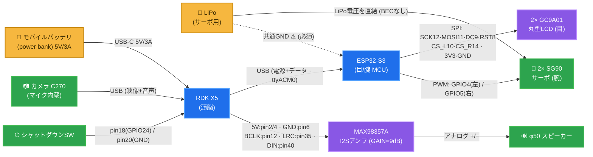

# コロ助 接続図 / Wiring & connection diagram

主要部品（RDK X5 / ESP32-S3 / カメラ / MAX98357A / スピーカー / 目 / 腕サーボ /
電源2系統）の接続。**電源は2系統（RDK用モバイルバッテリ ＋ サーボ用LiPo）で、GNDは共通**。

**凡例 / Legend**: 🟡 電源 ・ 🔵 コンピュート(基板) ・ 🟣 モジュール ・ 🟢 周辺機器。
モジュールはすべて□(矩形)、**ピン番号は各配線(矢印)のラベル**に記載。

## 接続表（配線一覧）

| From | ピン/ポート | → To | ピン | 内容 |
|---|---|---|---|---|
| モバイルバッテリ | USB-C 5V/3A | RDK X5 | USB-C(電源) | RDK電源 |
| RDK X5 | USB-A | ESP32-S3 | USB(ネイティブCDC) | **電源+データ**（`/dev/ttyACM0`） |
| RDK X5 40pin | **2/4**=5V, **6**=GND | MAX98357A | VIN, GND | アンプ電源 |
| RDK X5 40pin | **12**=BCLK, **35**=LRC, **40**=DIN | MAX98357A | BCLK/LRC/DIN | I2S音声出力 |
| MAX98357A | +/− | φ50スピーカー | — | アナログ出力 |
| RDK X5 40pin | **18**(GPIO24), **20**(GND) | 押しボタン | — | 安全シャットダウン |
| RDK X5 | USB-A | カメラ C270 | USB | 映像 + マイク |
| ESP32-S3 | 12/11/9/8/10/14 + 3V3/GND | 2× GC9A01 | SCK/MOSI/DC/RST/CS_L/CS_R | 目（SPI共有・CS分離） |
| ESP32-S3 | **GPIO4**(左) / **GPIO5**(右) | 2× SG90 | 信号 | 腕サーボPWM |
| LiPo | 電圧を直結 | SG90 サーボ | V+ | **サーボ専用電源（BEC/レギュレータなし）** |
| LiPo | GND | ESP32-S3 / RDK | GND | **共通GND（必須）** |

## 注意 / ポイント
- **電源2系統**: RDK X5 はモバイルバッテリ（5V/3A以上・良質なUSB-Cケーブル。半差し/細ケーブルはブラウンアウトの原因 → [power_usb_troubleshooting.md](power_usb_troubleshooting.md)）。サーボは**別のLiPo**で駆動（突入電流でRDKを落とさないため）。
- **共通GND必須**: LiPo(サーボ) と ESP32-S3/RDK の GND を必ず繋ぐ。繋がないとサーボPWMが不安定。
- **サーボはLiPo電圧を直結**（5V BEC/レギュレータは入れていない）。SG90の定格(4.8〜6V)に収まるLiPo構成にすること（過電圧に注意）。
- **ESP32-S3への配線は基本USB1本**（電源+`ttyACM0`データ）。UART直結にする場合は ESP32 RX=GPIO18 / TX=GPIO17（[firmware/corosuke_eyes](../firmware/corosuke_eyes)）。
- **MAX98357A GAIN**: 未接続=9dB（既定）。詳細 → [rdk_x5_40pin_i2s_max98357a.md](rdk_x5_40pin_i2s_max98357a.md)。
- 目の詳細ピンは [firmware/corosuke_eyes/src/main.cpp](../firmware/corosuke_eyes/src/main.cpp) 冒頭コメント参照。
