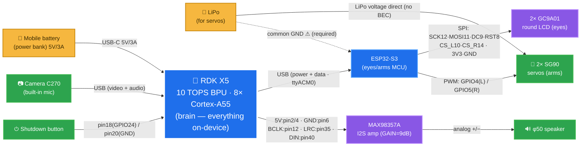

# Korosuke — Wiring & connection diagram

How the main parts connect: RDK X5 / ESP32-S3 / camera / MAX98357A / speaker / eyes /
arm servos, and **two power rails** (power bank for the RDK X5 + LiPo for the servos) with a
**shared common ground**.

**Legend**: 🟡 Power · 🔵 Compute (board) · 🟣 Module · 🟢 Peripheral.
All parts are boxes; **pin numbers are on the wires (edge labels)**.

## Connection table

| From | Pin / port | → To | Pin | Signal |
|---|---|---|---|---|
| Mobile battery | USB-C 5V/3A | RDK X5 | USB-C (power) | RDK power |
| RDK X5 | USB-A | ESP32-S3 | USB (native CDC) | **power + data** (`/dev/ttyACM0`) |
| RDK X5 40-pin | **2/4**=5V, **6**=GND | MAX98357A | VIN, GND | amp power |
| RDK X5 40-pin | **12**=BCLK, **35**=LRC, **40**=DIN | MAX98357A | BCLK/LRC/DIN | I2S audio out |
| MAX98357A | +/− | φ50 speaker | — | analog out |
| RDK X5 40-pin | **18**(GPIO24), **20**(GND) | Push button | — | safe shutdown |
| RDK X5 | USB-A | Camera C270 | USB | video + mic |
| ESP32-S3 | 12/11/9/8/10/14 + 3V3/GND | 2× GC9A01 | SCK/MOSI/DC/RST/CS_L/CS_R | eyes (shared SPI, separate CS) |
| ESP32-S3 | **GPIO4**(L) / **GPIO5**(R) | 2× SG90 | signal | arm servo PWM |
| LiPo | voltage direct | SG90 servos | V+ | **servo power (no BEC/regulator)** |
| LiPo | GND | ESP32-S3 / RDK | GND | **common ground (required)** |

## Notes
- **Two power rails**: the RDK X5 runs from the power bank (5V/3A+, a good USB-C cable — a
  half-seated / thin cable causes brown-outs → [power_usb_troubleshooting.md](power_usb_troubleshooting.md)).
  The servos run from a **separate LiPo** (so servo inrush current can't drop the RDK).
- **Common ground is required**: tie the LiPo (servo) GND to the ESP32-S3 / RDK GND, or the
  servo PWM will be unstable.
- **Servos run directly on the LiPo voltage** — no 5V BEC/regulator is fitted. Choose a LiPo
  within the SG90 range (4.8–6V); avoid over-voltage.
- **ESP32-S3 is wired with a single USB cable** (power + `ttyACM0` data). To use a direct UART
  instead: ESP32 RX=GPIO18 / TX=GPIO17 ([firmware/corosuke_eyes](../firmware/corosuke_eyes)).
- **MAX98357A GAIN**: floating = 9 dB (default). Details → [rdk_x5_40pin_i2s_max98357a.md](rdk_x5_40pin_i2s_max98357a.md).
- Full eye pinout: see the header comment in [firmware/corosuke_eyes/src/main.cpp](../firmware/corosuke_eyes/src/main.cpp).
