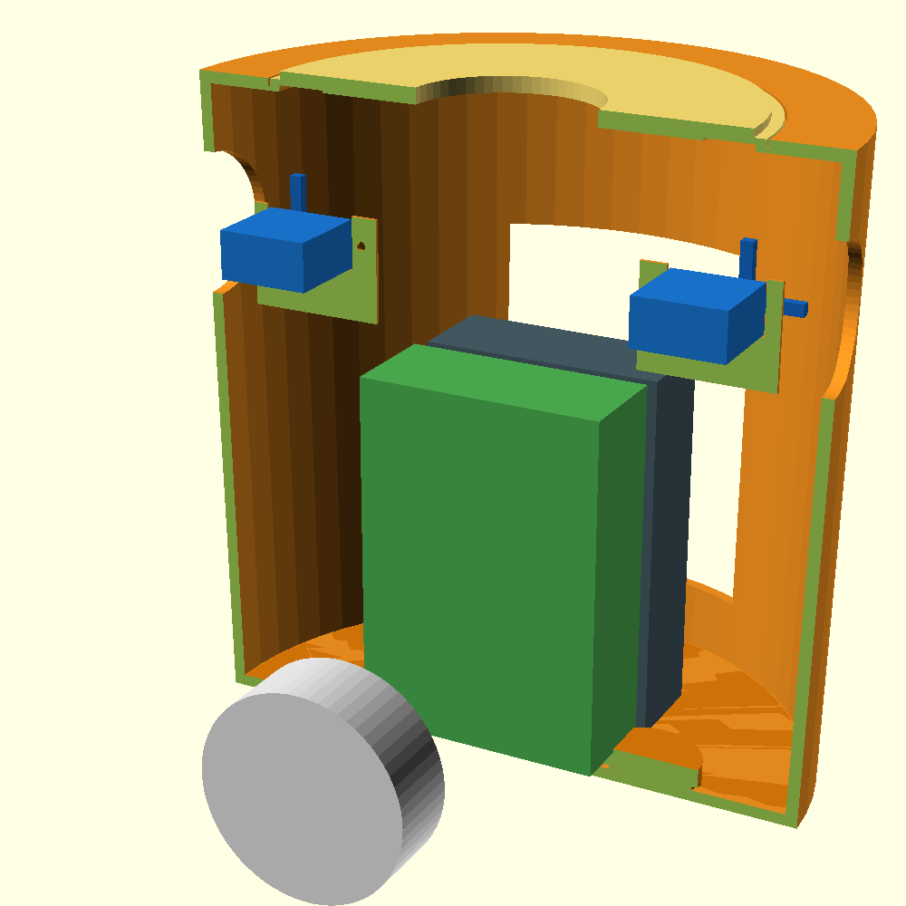

# 胴体 v3 (simple) — 作り直したシンプル版

複雑化した v2 を整理し、**部品3種＋FreeCADで開けるCSG**にした版。
ソース: [torso_v3.scad](torso_v3.scad)



## 方針
- **mirror() / offset() / 円錐との交差 を一切使わない** → FreeCADで `.csg` がそのまま開ける（`Null input shape` が出ない）。
- RDK/バッテリーは**ベルクロ固定**（レール等の複雑物を廃止）。ESP32-S3+ブレッドボードは頭部へ。
- 全パーツ平置き・サポート不要。

## パーツ（3種）
| SHOW | ファイル | 色 | 個数 | 備考 |
|---|---|---|---|---|
| 1 | `stl/shell_v3.stl` | 🟠橙 | 1 | 胴シェル＋**サーボ台一体**（十字ホーンのSG90×2） |
| 2 | `stl/bottom_v3.stl` | 🟠橙 | 1 | 底板（ケーブル窓・脚ボス・支柱ノッチ） |
| 3 | `stl/lid_v3.stl` | 🟠橙 | 1 | 天面リッド（首穴φ46・落とし込み） |

## 搭載
| 部品 | 寸法 | 位置 |
|---|---|---|
| RDK X5ケース | 91.4×62.4×27.1（上下+5mm余裕） | 中央・縦置き（ベルクロ） |
| モバイルバッテリー | 62×24×95（`PB_*`可変） | 背面（ベルクロ） |
| SG90 ×2（十字ホーン） | 軸(x=±58, z=127) | 腕穴直下のクレードル。掃引円は壁/床とクリア |
| スピーカー | φ50×18.5（秋月WYGD50D-8） | 前面グリル裏 |
| 胸カメラ | φ12窓（Arducam IMX291推奨） | 前面 z=100 |

## SG90の向き（重要）
- 十字ホーンは軸まわり**半径≈16mmで掃引** → ホーン面をクレードル**背面の後ろ(y≈3)**に置き干渉回避。
- **軸端を外＝腕穴側**に向けて上から落とし込み、内側タブを**M2×1**で固定（左右で逆）。
- ホーンは「真上→内側」だけ使用（外側は壁に当たる）。

## FreeCADで見る（CSG）
**ファイル > 開く** → `torso_v3_assembly_cut.csg`（断面＋部品）または `torso_v3_assembly.csg`（全体）。
→ v3はmirror/offset/円錐交差を使わないので、CSGがエラーなく開けます。

## 印刷前の現物合わせ
- バッテリー実寸 → `PB_W/PB_T` / カメラ基板ピッチ → （窓φ12は共通）。
- 変更したら該当SHOWだけ再レンダリング:
  ```
  openscad -o stl/shell_v3.stl -D SHOW=1 torso_v3.scad
  ```

*v2（rails/deck/カメラボス付きの詳細版）は上位フォルダに残置。v3は「まず動く最小構成」。*
